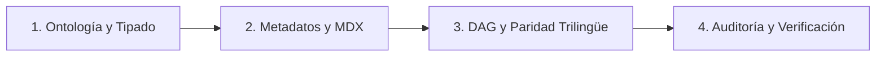

# Generador y Estándar de Contenido — Matematika

Guía ejecutiva y estándar metodológico para la creación, formalización y refactorización de nodos de contenido en formato MDX dentro de la enciclopedia matemática **Matematika**.

El sistema modela el conocimiento como un **grafo acíclico dirigido (DAG) de nodos atómicos hiperenlazados** con interactividad visual y paridad trilingüe estricta (**Castellano**, **Euskara Batua** e **Inglés**).

---

## Flujo de Trabajo para Creación / Edición de Nodos (Runbook)



### 1. Ontología y Disciplina de Tipos
- Determinar el tipo de entidad formal (`definicion`, `axioma`, `teorema`, `modelo`, `sistema-axiomatico`, etc.).
- Respetar la frontera epistémica y el orden deductivo real: no usar conceptos derivados en primitivos, ni nociones métricas o de orden en incidencia pura.
- Evitar colapsos de tipos en estructuras multisort ($\mathcal{P} \cap \mathcal{L} = \emptyset \implies \ell \not\subseteq \pi$; usar incidencia $P \, \mathbf{I} \, \ell$ o trazas $\operatorname{tr}(\ell)$).
- Consultar: [Filosofía Editorial y Principios Epistemológicos](./references/editorial-epistemology.md).

### 2. Metadatos y Redacción MDX
- Configurar `export const metadata` con `id` kebab-case, `type`, `branch` MSC2020 válido (2 dígitos o 2 dígitos + letra, e.g. `"51A"`).
- Redactar con apertura descriptiva pura e inmediata (cero fórmulas introductorias redundantes o defensivas).
- Usar componentes JSX nativos (`<Definicion>`, `<Formula>`, `<VisualBind>`, `<SeccionPropiedades>`).
- Mantener KaTeX conforme a ISO 80000-2 y aislado léxicamente del AST de JSX (nunca JSX dentro de `$`).
- Consultar:
  - [Esquema de Metadatos](./references/metadata-schema.md)
  - [Catálogo de Componentes MDX](./references/mdx-components.md)
  - [Estándares de Notación KaTeX](./references/katex-notation.md)

### 3. Grafo, Hiperenlaces y Paridad Trilingüe
- **Grafo Abierto:** Enlazar con `<ConceptLink targetId="...">` a todo concepto relevante, incluso si su archivo aún no existe en el repositorio.
- **Causalidad DAG (`isDependency`):** Marcar `isDependency={true}` **únicamente** en dependencias lógicas deductivas directas (obligatorio en términos primitivos de axiomas y antecedentes de teoremas; prohibido en definiciones primitivas, modelos o biografías).
- **Paridad 1:1:** Replicar exactamente la misma estructura de enlaces, dependencias y bindings visuales en `es/`, `en/` y `eu/`.
- Consultar:
  - [Grafo Lógico y Catálogo de targetId](./references/dag-and-hyperlinks.md)
  - [Glosario Técnico de Euskara Batua](./references/euskara-glossary.md)

### 4. Auditoría y Verificación
- Ejecutar la suite automatizada antes de finalizar cambios:
  ```bash
  npm run validate-references   # Esquemas y referencias cruzadas
  npm run validate-graph        # Aciclicidad y dependencias del DAG
  npm run typecheck             # Tipos TypeScript / MDX
  ```

---

## Tabla Rápida de Tipos de Contenido

| Tipo (`type`) | Rol Epistemológico | `isDependency` | `<SeccionPropiedades>` | Referencia |
| :--- | :--- | :---: | :---: | :--- |
| **`definicion`** | Noción base o derivada | `true` en constitutivos (omitir en primitivos) | ✅ Permitido | [metadata-schema.md](./references/metadata-schema.md) |
| **`axioma`** | Postulado atómico indecomponible | `true` en primitivos de signatura | ❌ Prohibido | [metadata-schema.md](./references/metadata-schema.md) |
| **`teorema`** / **`lema`** | Proposición demostrada | `true` en axiomas/teoremas usados | Opcional | [metadata-schema.md](./references/metadata-schema.md) |
| **`demostracion`** | Deducción formal paso a paso | `true` en justificaciones lógicas | N/A | [metadata-schema.md](./references/metadata-schema.md) |
| **`sistema-axiomatico`** | Formalización $(\mathcal{S}, \sigma, \mathcal{T})$ | N/A (usa campo `axiomas`) | ❌ Prohibido | [metadata-schema.md](./references/metadata-schema.md) |
| **`modelo`** | Estructura de satisfacción | Omitir (`false` por defecto) | ✅ Requerido (Satisfacción + Invariantes) | [metadata-schema.md](./references/metadata-schema.md) |
| **`matematico`** | Entrada biográfica / histórica | ❌ Prohibido | ❌ Prohibido | [metadata-schema.md](./references/metadata-schema.md) |

---

## Reglas Críticas Innegociables (Golden Rules)

1. **Aislamiento Léxico KaTeX / JSX:** Nunca colocar etiquetas JSX dentro de delimitadores matemáticos (`$` o `$$`).
   - ❌ `$\mathcal{P} = \{ \text{<VisualBind ...>A</VisualBind>} \}$`
   - ✅ `$\mathcal{P} = \{$ <VisualBind ...>$A$</VisualBind> $\}$`
2. **Sin type mismatch entre primitivos:** Una recta no es un subconjunto de un plano ($\ell \not\subseteq \pi$). Usar incidencia $P \, \mathbf{I} \, \ell$ o trazas $\operatorname{tr}(\ell) \subseteq \operatorname{tr}(\pi)$.
3. **Sin `<SeccionPropiedades>` en axiomas:** Los axiomas son atómicos. Sus consecuencias son teoremas en `theorems/`.
4. **Paridad trilingüe 1:1:** Todo `<ConceptLink targetId="..." isDependency={...}>` en `es/` debe existir idéntico en `en/` y `eu/`.
5. **Grafo abierto obligatorio:** Todo concepto matemático debe llevar `<ConceptLink targetId="...">`, existan o no las páginas de destino.

---

## Directorio de Módulos de Referencia

Para consultar especificaciones detalladas, ejemplos completos y tablas normativas, acceder a los módulos temáticos correspondientes:

1. 🏛️ **[Filosofía Editorial y Principios Epistemológicos](./references/editorial-epistemology.md)**  
   *Inmediación ontológica, disciplina de tipos multisort, deslinde semántica-metalógica, frontera epistémica, cadenas deductivas y estratificación condicional.*

2. 📋 **[Esquema de Metadatos (`export const metadata`)](./references/metadata-schema.md)**  
   *Definición formal de campos, compatibilidad taxonómica MSC 2020 y especificación por tipo de nodo.*

3. 🕸️ **[Grafo Lógico, Enlaces Hipertextuales y Catálogo de `targetId`](./references/dag-and-hyperlinks.md)**  
   *Principio de grafo abierto, matriz de reglas para `isDependency`, paridad trilingüe y catálogo kebab-case canónico.*

4. 🧩 **[Catálogo de Componentes MDX](./references/mdx-components.md)**  
   *Componentes JSX (`<Definicion>`, `<VisualBind>`, `<Formula>`, etc.), paleta de colores semánticos, aislamiento AST y restricciones de `<SeccionPropiedades>`.*

5. 📐 **[Estándares de Notación KaTeX (ISO 80000-2)](./references/katex-notation.md)**  
   *Tabla canónica de símbolos matemáticos modernos, comandos KaTeX admitidos y notaciones prohibidas/desaconsejadas.*

6. 🌐 **[Glosario Técnico y Estándar de Euskara Batua](./references/euskara-glossary.md)**  
   *Diccionario de términos normalizados, expresiones desaconsejadas y pautas de traducción académica rigurosa.*