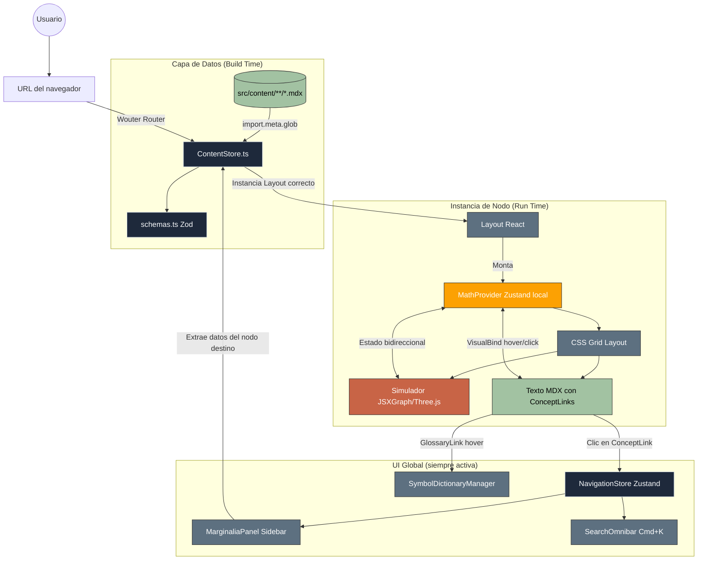
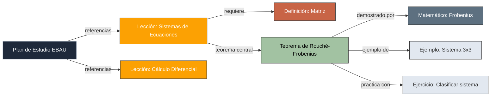

# 05 — Diagrama de Arquitectura y Flujo de Datos

## Diagrama Principal: Flujo de un Nodo

---

## Diagrama de Tipos de Contenido

---

## Notas Clave del Diseño

### Por qué MathProvider es Local (no Global)
Si el estado matemático fuese global, al navegar de `/teorema/pitagoras` a `/teorema/bayes`, las coordenadas del triángulo pitagórico seguirían vivas en memoria. Three.js y JSXGraph adjuntan listeners al DOM; sin cleanup hay **memory leaks**. Al ser el MathProvider un React Context local, cuando Wouter desmonta el nodo, React desmonta el Provider y el Garbage Collector limpia toda la memoria gráfica.

### Por qué NavigationStore sí es Global
El estado de si el MarginaliaPanel está abierto, o qué nodo muestra el Omnibar, debe persistir mientras el usuario navega. Cerrar el panel al cambiar de página sería una mala UX. Por eso estos estados viven en un store de Zustand global.

### Por qué Wouter y no React Router
Wouter no requiere un `BrowserRouter` wrapper ni genera código muerto. En un proyecto donde las rutas se generan dinámicamente (no hay lista estática de rutas), la ligereaza de Wouter y su API de `Switch`/`Route` son suficientes y más rápidas de iterar.
