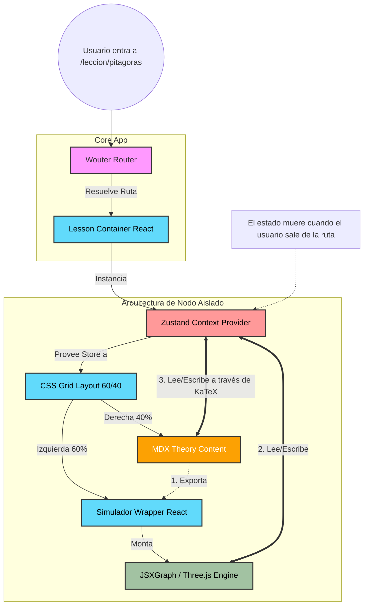

# 05. Arquitectura de Componentes y Flujo de Datos

Este documento define la estructura visual y de datos de la aplicación Matematika, basada en el diseño de Estado Aislado y MDX Bridge.

## Diagrama de Componentes (Navegación de un Nodo)

### Explicación del Flujo
1. **Enrutamiento:** Wouter detecta la URL e instancia el Contenedor principal de la lección.
2. **Contexto Aislado:** El contenedor NO usa un store global de Zustand. Envuelve la lección en un `Provider` de React que inicializa un store de Zustand virgen. Al salir de la lección, este store es destruido por el Garbage Collector.
3. **Layout Estructural:** Un contenedor Grid separa visualmente la pantalla.
4. **Hermanos (Siblings):** El texto (MDX) y el lienzo gráfico son hermanos. Se comunican única y exclusivamente a través del Store central de Zustand provisto por su padre.
