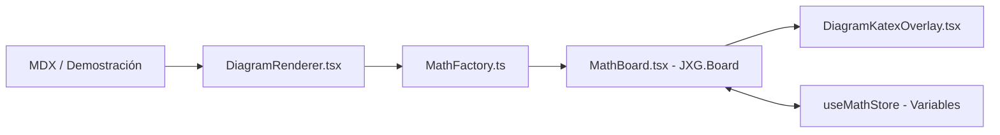

# Motor de diagramas interactivas (JSXGraph)

El código del motor de diagramas está en [src/diagrams/](file:///home/izaro/Proiektuak/Matematika_Drafts/src/diagrams/). Se encarga de renderizar representaciones geométricas y analíticas 2D interactivas, tanto dentro de los artículos MDX como en el panel lateral Marginalia.

---

## Cómo se organiza el motor

```
src/diagrams/
├── model/        # Tipado y esquemas JSON para definir una escena (puntos, líneas, funciones)
├── geometry/     # Funciones matemáticas helper y cálculos de geometría 2D
├── jsxgraph/     # Wrapper del tablero JSXGraph (MathBoard.tsx) y fábrica (MathFactory.ts)
└── render/       # Renderizador React (DiagramRenderer.tsx) y capa KaTeX (DiagramKatexOverlay.tsx)
```

---

## Flujo de renderizado de un diagrama



### 1. Definición de la escena (`model/`)
Cada diagrama se describe con una estructura declarativa en JSON o TypeScript que define el tamaño del lienzo, los ejes coordenados y los elementos presentes (puntos, rectas, polígonos, curvas, ángulos).

### 2. Gestión del tablero (`MathBoard.tsx`)
Encapsula la creación del lienzo de JSXGraph (`JXG.JSXGraph.initBoard`):
- Redimensiona el tablero cuando cambia el tamaño del contenedor.
- Gestiona eventos de ratón y gestos táctiles para arrastrar elementos.
- Destruye la instancia del tablero al desmontar el componente para evitar fugas de memoria.

### 3. Creación de elementos (`MathFactory.ts`)
Aplica los estilos del sistema de diseño (colores terracota, carbón, trazos opacos) al instanciar puntos, líneas o funciones en JSXGraph.

---

## Capa de fórmulas con KaTeX (`DiagramKatexOverlay.tsx`)

Los textos por defecto en los canvas de HTML5 o SVG no tienen la calidad tipográfica adecuada para fórmulas matemáticas. Para solucionarlo:

- Matematika coloca una capa HTML transparente sobre el tablero.
- Cada etiqueta matemática se renderiza con **KaTeX**.
- Al arrastrar un punto o mover un objeto, la capa calcula las coordenadas relativas en pantalla y desplaza la fórmula en tiempo real junto al elemento.

---

## Reactividad entre controles MDX y el diagrama (`MathStore`)

Los componentes MDX (como un deslizador o un botón de opción) se comunican con los diagramas a través de **`useMathStore`** ([src/lib/page-context/MathStore.ts](file:///home/izaro/Proiektuak/Matematika_Drafts/src/lib/page-context/MathStore.ts)):

1. Cada página MDX envuelve su contenido en un `<MathProvider>`.
2. Si un usuario mueve un deslizador `<Slider varName="radio" min={1} max={10} />`, este ejecuta `setVariable("radio", valor)`.
3. `DiagramRenderer` escucha los cambios en `radio` y actualiza la posición o forma de los objetos en el tablero sin necesidad de volver a renderizar todo el árbol DOM de React.

---

## Dónde están los diagramas publicados

Los diagramas que usan los autores en sus artículos están en [content/diagrams/](file:///home/izaro/Proiektuak/Matematika_Drafts/content/README.md) y se importan en MDX con la sintaxis `@content/diagrams/...`.

El comando `npm run diagram-usages:check` se encarga de revisar que ningún artículo importe un diagrama inexistente o mal formado.
