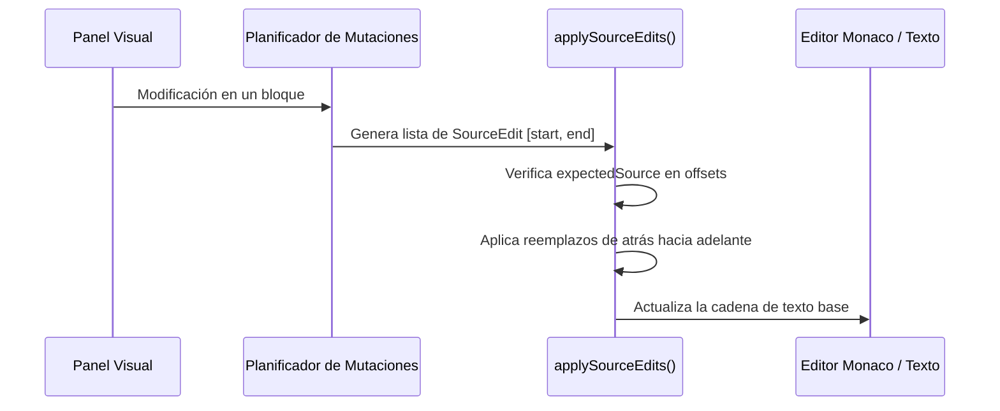

# Cómo funciona el Editor MDX por dentro

El editor de Matematika vive en [src/fixed-pages/editor/](file:///home/izaro/Proiektuak/Matematika_Drafts/src/fixed-pages/editor/). Permite editar artículos MDX de dos formas: editando el código fuente directamente en **Monaco** o modificando bloques visualmente en un panel **WYSIWYG**.

El reto principal que resuelve este motor es **no romper el código original**: si editas un título o un texto en el panel visual, el editor modifica únicamente los bytes de ese bloque sin tocar el resto del archivo, manteniendo comentarios, espacios y sintaxis personalizada.

---

## Estructura de carpetas del editor

```
src/fixed-pages/editor/
├── session/          # Hook principal useEditorCore.ts, estado dirty, carga y guardado
├── document/         # Motor de parsing sin pérdidas, parches de texto por offsets
├── ui/               # Paneles visuales (CodeEditorPanel, VisualEditorPanel, MetadataPanel)
├── save/             # Coordinador de guardado y persistencia local (SaveCoordinator)
└── diagrams/         # Workbench para construir e inspeccionar diagramas JSXGraph
```

---

## Cómo funciona la edición sin pérdidas

### 1. Extracción de bloques con offsets exactos
El motor usa `unified` + `remark-parse` + `remark-mdx` para analizar el documento MDX. En lugar de convertir todo el documento a un AST abstracto para luego volver a generar texto desde cero (lo cual destruiría el formato original), el parser registra las coordenadas exactas de inicio y fin en bytes (`start.offset`, `end.offset`) de cada fragmento.

### 2. Tipos de bloques en un documento
Cada fragmento del documento se clasifica en una de tres categorías:

- **`EditableBlock`**: Componentes con esquema visual conocido (encabezados, tarjetas de teoremas, bloques de ejercicio, listas). Se pueden editar visualmente.
- **`PreservedBlock`**: Markdown o HTML estándar. Se mantiene intacto byte por byte a menos que se modifique explícitamente.
- **`OpaqueBlock`**: Componentes o expresiones JSX avanzadas no registradas. El editor los protege para evitar modificaciones accidentalmente en el panel visual.

### 3. Nivel de compatibilidad de un archivo

| Modo | Qué significa | Cómo se comporta el editor |
|---|---|---|
| `fully-editable` | Todo el cuerpo del documento está formado por bloques reconocidos. | Edición visual completa activada. |
| `partially-editable` | Combina bloques editables con bloques preservados o complejos. | Permite editar los bloques seguros sin tocar las partes complejas. |
| `read-only` | Contiene estructuras que no se pueden editar visualmente. | Solo permite cambios desde el editor de código. |
| `unsupported` | El archivo tiene un error de sintaxis MDX. | Fuerza el modo código en Monaco hasta corregir el error. |

---

## Aplicación de parches de texto (`applySourceEdits`)

Cuando cambias un dato en el panel visual:

1. El planificador (`structuralOperations.ts`) calcula los offsets exactos `[start, end]` del fragmento que cambia y genera un `DocumentMutationPlan`.
2. `applySourceEdits.ts` comprueba que el texto original en esa posición coincide con lo esperado (`expectedSource`).
3. Aplica los cambios ordenados desde el final del archivo hacia el principio para no descolocar las coordenadas de otros bloques.
4. Vuelve a parsear el documento inmediatamente para verificar que el texto final es MDX válido.



---

## Integración con Monaco Editor

El panel de código ([CodeEditorPanel.tsx](file:///home/izaro/Proiektuak/Matematika_Drafts/src/fixed-pages/editor/ui/panels/CodeEditorPanel.tsx)) usa `@monaco-editor/react`:

- **Navegación sincronizada**: Al hacer clic en un bloque del panel visual, el editor convierte los offsets en bytes del nodo AST a número de línea y columna en Monaco (`model.getPositionAt(offset)`) y desplaza el cursor automáticamente a esa línea (`revealRange`).
- **Diagnósticos al vuelo**: Las comprobaciones de sintaxis y Zod se reflejan como subrayados de error directamente en el código de Monaco.

---

## Reglas estáticas de seguridad (`check-editor-safety.ts`)

Para evitar problemas de rendimiento o seguridad en el editor, el script `npm run editor:safety:check` escanea el código del editor y falla si detecta:

1. **`fetch` directo en componentes de UI**: Las llamadas a API deben pasar por el repositorio de datos.
2. **`eval()` o `new Function()`**: Prohibida la ejecución dinámica de código.
3. **Diálogos sincrónicos (`alert`, `confirm`, `prompt`)**: Prohibidos para no bloquear el hilo de la UI.
4. **Supresiones de TypeScript (`@ts-ignore`, `@ts-nocheck`)**: No se permiten en el código del editor.
