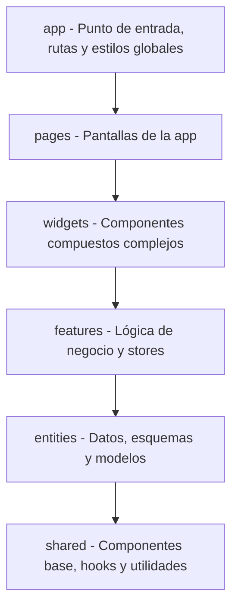

# Arquitectura del código en `src/` (Feature-Sliced Design)

El código fuente de la aplicación dentro de `src/` está estructurado siguiendo **Feature-Sliced Design (FSD)**. El objetivo es mantener las responsabilidades separadas y evitar acoplamientos raros entre pantallas, componentes de UI y lógica de datos.

---

## Organización por capas

Las carpetas principales dentro de `src/` ordenadas de mayor nivel a menor nivel:

### 1. `app/` (Inicialización y configuración global)
Aquí arranca la aplicación y se configuran las dependencias globales.
- `main.tsx`: Punto de entrada de React 18 en el DOM.
- `App.tsx`: Layout principal y contenedores de contextos/proveedores.
- `routes/AppRouter.tsx`: Configuración de rutas con `wouter`.
- `styles/`: Estilos globales CSS (`index.css`, `theme.css`).

### 2. `pages/` (Pantallas)
Se dividen en dos bloques según su naturaleza:
- **`fixed-pages/`**: Páginas fijas de la aplicación (la portada `home`, el visor del grafo `graph`, el diccionario `glossary`, la línea temporal de matemáticos `mathematicians` y el editor `editor`).
- **`content-pages/`**: Plantillas que renderizan artículos MDX (`screens/` para teoremas, definiciones, ejemplos, ejercicios, planes de estudio, etc.).

> **Nota arquitectónica**: `fixed-pages` y `content-pages` no se importan entre sí.

### 3. `widgets/` (Bloques de interfaz independientes)
Componentes visuales complejos que combinan UI y estado:
- `SearchOmnibar`: El modal de búsqueda global (`Cmd+K`).
- `MarginaliaPanel`: El panel desplegable/modal lateral para leer referencias sin salir del texto.
- `PageDependencyGraph`: El minigrafo incrustado en la cabecera de cada artículo.

### 4. `features/` (Funcionalidades de dominio)
Lógica de negocio y manejo de estado:
- **Marginalia**: Apertura y resolución de términos (`GlossaryStore.ts`).
- **Búsqueda**: Motor client-side con Fuse.js (`searchApi.ts`).
- **Simulaciones**: Sincronización entre controles MDX y JSXGraph (`MathStore.ts`).
- **Progreso del usuario**: Registro local de lectura y ejercicios resueltos (`UserProgressStore.ts`).
- **Cálculos pesados del grafo**: Recálculos delegados a un Web Worker (`graphWorkerClient.ts`).

### 5. `entities/` (Modelos y fuente de datos)
- `ContentStore`: Acceso a la base de datos de contenido (`src/data/content/ContentStore.ts`).
- `schemas/`: Validación de metadatos con Zod (`src/data/schemas/`).
- `diagrams/model/`: Especificación JSON de primitivas de diagramas.

### 6. `shared/` (Código base reutilizable)
Componentes sin lógica de negocio propia:
- Botones, insignias (`ContentTypeBadge.tsx`), pantallas de carga.
- Motor e integración de JSXGraph (`MathBoard.tsx`, `MathFactory.ts`, `DiagramKatexOverlay.tsx`).
- Helpers genéricos en `src/lib/`.

---

## Enrutamiento con `wouter`

El enrutador [src/app/routes/AppRouter.tsx](file:///home/izaro/Proiektuak/Matematika_Drafts/src/app/routes/AppRouter.tsx) gestiona las URLs mediante tres despachadores:

1. **Rutas de 3 segmentos (`/:lang/:segment/:id`)**:
   Mapea URLs traducidas (como `/es/teorema/pitagoras` o `/eu/teorema/pitagoras`) usando `SEGMENT_TO_CANONICAL_TYPE` para cargar la pantalla correspondiente.
2. **Rutas de 2 segmentos (`/:first/:second`)**:
   Maneja vistas fijas traducidas (como `/:lang/diccionario` o `/:lang/grafo`).
3. **Rutas de 1 segmento (`/:segment`)**:
   Resuelve `/es` o `/eu` hacia la portada local.

---

## Stores de Zustand en la aplicación

| Store | Archivo | Para qué sirve |
|---|---|---|
| `useMetadataStore` | `src/data/metadata/MetadataStore.ts` | Guarda los metadatos de la página activa (título, autor, TOC, dependencias). |
| `useGraphStore` | `src/fixed-pages/graph/GraphStore.ts` | Estado del lienzo del grafo, axiomas activos y modelo seleccionado. |
| `useMathStore` | `src/lib/page-context/MathStore.ts` | Store aislado por página con variables numéricas reactivas para los diagramas. |
| `useGlossaryStore` | `src/lib/stores/GlossaryStore.ts` | Términos abiertos en el panel Marginalia y modo de presentación. |
| `useNavigationStore` | `src/lib/stores/NavigationStore.ts` | Estado de apertura del buscador omnibar. |
| `useProgressStore` | `src/lib/stores/UserProgressStore.ts` | Artículos leídos y ejercicios completados (guardados en `localStorage`). |

---

## Paleta de colores y estilo visual

El tema visual ("Arts and Crafts") busca una estética clara y cómoda para lectura prolongada:
- **Lienzo** (`#fafaf9`): Fondo principal en tono papel.
- **Carbón** (`#1c1917`): Tipografía y elementos nítidos.
- **Canela / Terracota**: Tonos de acento para destacar teoremas y definiciones.
- **KaTeX**: Tipografía matemática estándar integrada en la jerarquía tipográfica.
