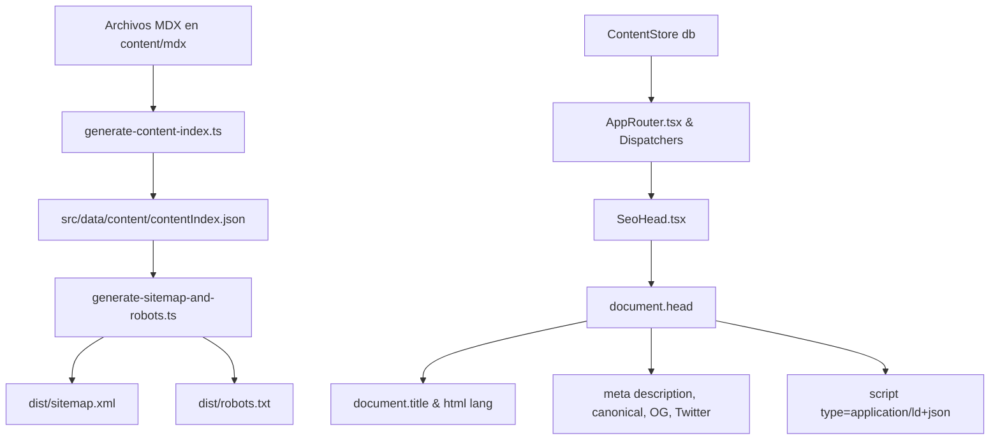

# Arquitectura de SEO, Metadatos y Descubribilidad

La infraestructura de SEO de Matematika proporciona metadatos dinámicos client-side, etiquetado de redes sociales, directiva de indexación selectiva (noindex para editores), esquemas de datos estructurados JSON-LD, favicons multi-resolución y generación automatizada en tiempo de build de `sitemap.xml` y `robots.txt`.

---

## Principios y Restricciones

1. **Arquitectura SPA (sin SSR/prerender)**: La aplicación se ejecuta como una SPA en el cliente con Vite y `wouter`. Los metadatos de las páginas activas se inyectan dinámicamente en el DOM a través del componente `SeoHead`.
2. **Generación en Build**: Los archivos estáticos de descubribilidad (`sitemap.xml`, `robots.txt`, `site.webmanifest` y favicons) se generan durante la fase de build (`npm run build` / `prebuild`).
3. **Noindex en Rutas Internas**: Las rutas de edición `/editor` y `/:lang/editor` contienen la directiva `<meta name="robots" content="noindex, nofollow" />` y se excluyen explícitamente tanto del `robots.txt` como del `sitemap.xml`.
4. **Reutilización de Metadatos MDX**: Se aprovecha el campo `description` ya presente en el frontmatter de todos los documentos MDX.
5. **Multi-idioma Nativo (hreflang)**: El `sitemap.xml` incluye anotaciones `hreflang` **únicamente** entre los idiomas (`es`, `eu`) donde el artículo realmente existe en ambos, determinado por `availableLangs`.

---

## Flujo de Datos y Componentes



---

## 1. Configuración de la URL Base (`src/lib/seo/siteUrl.ts`)

La URL base absoluta se resuelve dinámicamente mediante la función `getSiteUrl()` siguiendo este orden de prioridad:

1. Variable de entorno `VITE_SITE_URL` (o `process.env.VITE_SITE_URL`).
2. Variable de entorno `SITE_URL` (o `process.env.SITE_URL`).
3. Fallback: `https://izaro-c.github.io/Matematika` (extraído del campo `homepage` en `package.json`).

```typescript
import { getSiteUrl, getAbsoluteUrl } from '@/lib/seo/siteUrl';

// Ejemplo de uso:
const canonical = getAbsoluteUrl('/es/teorema/pitagoras');
// -> "https://izaro-c.github.io/Matematika/es/teorema/pitagoras"
```

---

## 2. Metadatos Dinámicos en Cliente (`src/components/seo/SeoHead.tsx`)

El componente `SeoHead` reacciona a los cambios de ruta y propiedades para actualizar en tiempo real:

- **`<title>`**: Formato `${title} | Matematika` o título institucional.
- **`<html lang>`**: Idioma activo (`es`, `eu`).
- **`<meta name="description">`**: Reutiliza `description` del MDX o fallbacks de i18n.
- **`<link rel="canonical">`**: URL absoluta canónica de la página actual.
- **`<meta name="robots">`**: Configurado a `noindex, nofollow` en rutas de editor y 404; `index, follow` en el resto.
- **Open Graph**: `og:title`, `og:description`, `og:url`, `og:type`, `og:image`, `og:locale`, `og:site_name`.
- **Twitter Cards**: `twitter:card` (`summary_large_image`), `twitter:title`, `twitter:description`, `twitter:image`.
- **JSON-LD**:
  - `BreadcrumbList`: Estructura jerárquica de migas de pan.
  - `EducationalArticle`: Para teoremas, demostraciones, métodos, ejemplos, ejercicios, planes de estudio y biografías.
  - `DefinedTerm`: Para definiciones, axiomas y términos del diccionario.

---

## 3. Generación en Build (`scripts/core/`)

| Script | Archivo de origen | Qué genera |
|---|---|---|
| `generate-seo` | `scripts/core/generate-sitemap-and-robots.ts` | `dist/sitemap.xml` y `dist/robots.txt` con URLs absolutas y hreflangs verificados. |
| `generate-seo-assets` | `scripts/core/generate-seo-assets.ts` | `public/images/og-default.png` (1200x630 px) y favicons (`favicon.ico`, PNG 16/32/180/192/512). |

### Integración en el Pipeline de Build (`package.json`)

```json
{
  "scripts": {
    "dev": "npm run generate-index && npm run generate-seo && npm run content:coverage && npm run validate-graph && npm run validate-references && vite",
    "prebuild": "npm run generate-index && npm run generate-seo && npm run content:coverage && npm run validate-graph && npm run validate-references",
    "generate-seo": "tsx scripts/core/generate-sitemap-and-robots.ts",
    "generate-seo-assets": "tsx scripts/core/generate-seo-assets.ts"
  }
}
```

---

## 4. Estructura del `robots.txt` y `sitemap.xml`

### `robots.txt`
```text
User-agent: *
Disallow: /editor
Disallow: /*/editor

Sitemap: https://izaro-c.github.io/Matematika/sitemap.xml
```

### `sitemap.xml` (Extracto con Hreflang Condicional)
```xml
<?xml version="1.0" encoding="UTF-8"?>
<urlset xmlns="http://www.sitemaps.org/schemas/sitemap/0.9"
        xmlns:xhtml="http://www.w3.org/1999/xhtml">
  <url>
    <loc>https://izaro-c.github.io/Matematika/es/teorema/teorema-pitagoras</loc>
    <lastmod>2026-08-23</lastmod>
    <changefreq>monthly</changefreq>
    <priority>0.7</priority>
    <xhtml:link rel="alternate" hreflang="es" href="https://izaro-c.github.io/Matematika/es/teorema/teorema-pitagoras" />
    <xhtml:link rel="alternate" hreflang="eu" href="https://izaro-c.github.io/Matematika/eu/teorema/teorema-pitagoras" />
    <xhtml:link rel="alternate" hreflang="x-default" href="https://izaro-c.github.io/Matematika/es/teorema/teorema-pitagoras" />
  </url>
</urlset>
```
