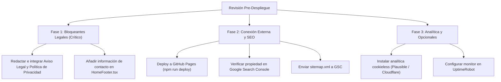

# Auditoría y Checklist Pre-Despliegue — Matematika

Este documento evalúa el estado del proyecto **Matematika** frente a la lista de verificación pre-despliegue recomendada para producción en España y la Unión Europea.

> **Contexto de Arquitectura**: Matematika es una Enciclopedia Matemática Interactiva construida como una **SPA estática (Jamstack)** con React 19, TypeScript, Vite, Tailwind CSS v4, Wouter y generación estática/prerenderizado con Puppeteer (`scripts/core/prerender.ts`). Se despliega mediante GitHub Actions en **GitHub Pages** (`https://izaro-c.github.io/Matematika/`). Muchos de los riesgos de CMS tradicionales (WordPress, bases de datos SQL, inyecciones en servidor, plugins desactualizados) quedan anulados por diseño arquitectónico.

---

## 📊 Resumen Ejecutivo del Estado

| Bloque | Total Ítems | ✅ Cumplido | 🟡 Parcial / Externo | ❌ Pendiente | ⚪ No Aplica (Jamstack) |
|---|:---:|:---:|:---:|:---:|:---:|
| **1. Contenido y Textos** | 4 | 0 | 2 | 2 | 0 |
| **2. Seguridad** | 6 | 2 | 1 | 0 | 3 |
| **3. Cumplimiento Legal (RGPD/LOPD)** | 4 | 1 | 0 | 2 | 1 |
| **4. Rendimiento** | 3 | 3 | 0 | 0 | 0 |
| **5. SEO Básico** | 6 | 5 | 1 | 0 | 0 |
| **6. Funcionalidad** | 4 | 3 | 0 | 0 | 1 |
| **7. Accesibilidad** | 3 | 3 | 0 | 0 | 0 |
| **8. Analítica y Monitorización** | 3 | 0 | 1 | 1 | 1 |
| **9. Última Revisión antes de Publicar** | 3 | 2 | 1 | 0 | 0 |
| **TOTAL** | **36** | **19 (53%)** | **6 (17%)** | **5 (14%)** | **6 (17%)** |

---

## 1. Contenido y Textos

### 1.1 Sin errores ortográficos/gramaticales
- **Estado**: 🟡 **Parcial / Requiere revisión manual**
- **Diagnóstico**:
  - El repositorio cuenta con 336 artículos MDX en `content/mdx/` redactados en Castellano (`es`) y Euskara Batua (`eu`).
  - La redacción matemática sigue directrices deductivas rigurosas (`docs/content/mdx-authoring-guide.md` y la skill `matematika-content-generator`).
  - **Falta**: No existe un linter o corrector ortográfico automatizado en el pipeline de CI (como `cspell` con diccionarios de español, euskera y vocabulario matemático).
- **Acción recomendada**:
  - Pasar un corrector gramatical a las cadenas del diccionario de internacionalización (`src/i18n/languages/es.ts` y `eu.ts`).
  - Opcional: Configurar `cspell` en `package.json` para validar futuros commits.

### 1.2 Textos legales completos (Aviso Legal, Privacidad, Cookies)
- **Estado**: ❌ **Pendiente (Bloqueante Legal para España/UE)**
- **Diagnóstico**:
  - Actualmente **no existen rutas, páginas ni enlaces** para Aviso Legal, Política de Privacidad ni Política de Cookies en `src/app/routes/AppRouter.tsx` ni en `HomeFooter.tsx`.
  - La Ley 34/2002 (LSSI-CE) y el RGPD exigen que cualquier prestador de servicios de la sociedad de la información accesible al público en España cuente con estos textos accesibles desde cualquier página del sitio (típicamente en el pie de página).
- **Acción recomendada**:
  1. Crear las páginas estáticas `/es/aviso-legal`, `/es/privacidad`, `/es/cookies` (y sus variantes en euskera `/eu/lege-oharra`, `/eu/pribatutasuna`, `/eu/cookie-politika`).
  2. Añadir enlaces permanentes en `HomeFooter.tsx` y en el menú global de navegación.

### 1.3 Información de contacto visible (email, teléfono o formulario funcional)
- **Estado**: ❌ **Pendiente**
- **Diagnóstico**:
  - En la página principal (`HomePage.tsx`), el encabezado (`TopBar.tsx`) y el pie de página (`HomeFooter.tsx`) no figura ninguna dirección de correo de contacto, enlace institucional ni vía de comunicación con el titular del proyecto.
- **Acción recomendada**:
  - Incluir en el footer un enlace `mailto:` o un enlace al perfil de GitHub / formulario de contacto institucional del autor/organización.

### 1.4 Datos del titular / empresa (nombre, NIF/CIF, dirección si aplica)
- **Estado**: 🟡 **Pendiente de definir por el titular**
- **Diagnóstico**:
  - Si el proyecto se publica a título personal/académico sin actividad económica, la LSSI-CE modula la exigencia del NIF mercantil, pero el RGPD sigue requiriendo identificar al responsable del tratamiento. Si hay una entidad o autónomo promotor, deben figurar Nombre completo / Razón social, NIF y dirección física en el Aviso Legal.
- **Acción recomendada**:
  - Definir la titularidad que figurará en el Aviso Legal (e.g., Proyecto de Software Libre educativo / Nombre del desarrollador / Entidad).

---

## 2. Seguridad

### 2.1 Certificado SSL/HTTPS activo
- **Estado**: ✅ **Cumplido**
- **Diagnóstico**:
  - El sitio está alojado en GitHub Pages bajo `https://izaro-c.github.io/Matematika/`.
  - GitHub Pages gestiona y renueva automáticamente certificados TLS/SSL vía Let's Encrypt con la directiva "Enforce HTTPS".
  - Todas las URLs canónicas y enlaces generados en `src/lib/seo/siteUrl.ts` resuelven forzosamente a protocolo `https://`.

### 2.2 Contraseñas fuertes en hosting, CMS y panel de administración
- **Estado**: ⚪ **No Aplica (Arquitectura Estática Jamstack)**
- **Diagnóstico**:
  - Matematika **no tiene WordPress, Drupal, backend PHP ni base de datos MySQL**.
  - No existe panel de administración en servidor (`/wp-admin`, `/admin`) susceptible de ataques de fuerza bruta.
  - La seguridad del despliegue recae en las credenciales de GitHub (MFA/2FA obligatorio en cuentas de desarrollador y tokens de despliegue `GITHUB_TOKEN` efímeros en GitHub Actions).

### 2.3 Plugins y CMS actualizados
- **Estado**: ✅ **Cumplido / No aplica CMS tradicional**
- **Diagnóstico**:
  - Sin plugins de terceros vulnerables de CMS.
  - Las librerías de Node se analizan en CI mediante scripts específicos en `package.json`:
    - `npm run audit:security` (`semgrep scan --config auto`).
    - `npm run audit:deps` (`osv-scanner --lockfile=package-lock.json`).
  - React 19, Vite 8 y Tailwind 4 actualizados a sus versiones estables.

### 2.4 Copias de seguridad automáticas con restauración
- **Estado**: ✅ **Cumplido (Git / GitHub)**
- **Diagnóstico**:
  - Todo el contenido matemático (MDX), código fuente y assets están en control de versiones Git inmutable en GitHub.
  - Cada commit actúa como una instantánea recuperable de todo el sistema.
  - El pipeline de despliegue genera el artefacto en cada push a `main`.

### 2.5 Formularios protegidos contra spam (reCAPTCHA / Turnstile)
- **Estado**: ⚪ **No Aplica actualmente**
- **Diagnóstico**:
  - El sitio público es de solo lectura y consulta; **no dispone de formularios de contacto públicos ni comentarios**.
  - Los únicos `<form>` de la aplicación pertenecen al editor interno local (`/editor`), que no procesa envíos abiertos a internet.
  - *Nota*: Si en el futuro se añade un formulario de contacto externo (e.g. Formspree o Cloudflare Workers), se deberá integrar un honeypot o Cloudflare Turnstile.

### 2.6 Cabeceras de seguridad configuradas (CSP, X-Frame-Options, etc.)
- **Estado**: 🟡 **Parcial (Condicionado por GitHub Pages)**
- **Diagnóstico**:
  - GitHub Pages es un servidor de archivos estáticos que no permite personalizar cabeceras HTTP en el servidor (salvo que se canalice a través de un proxy inverso como Cloudflare).
  - En `index.html` no hay etiquetas `<meta http-equiv="...">` que apliquen políticas de seguridad a nivel de documento.
- **Acción recomendada**:
  - Añadir en `index.html`:
    ```html
    <meta http-equiv="X-Content-Type-Options" content="nosniff" />
    <meta name="referrer" content="strict-origin-when-cross-origin" />
    ```
  - Si en el futuro se desea CSP estricto y HSTS con calificación A+ en Mozilla Observatory, se puede colocar Cloudflare delante de GitHub Pages o migrar el hosting a Cloudflare Pages / Vercel.

---

## 3. Cumplimiento Legal (RGPD / LOPD)

### 3.1 Banner de cookies con opción real de rechazar
- **Estado**: ⚪ **Exento actualmente (Sin cookies no técnicas)** / ❌ **Obligatorio si se instala analítica**
- **Diagnóstico**:
  - Actualmente, Matematika **no instala ninguna cookie de rastreo, analítica ni publicidad**.
  - Solo utiliza `localStorage.getItem('theme')` para guardar la preferencia visual (claro/oscuro), lo cual es almacenamiento exclusivamente técnico y necesario, exento de consentimiento según el Art. 22.2 LSSI y directrices de la AEPD.
  - Por tanto, actualmente no necesita banner de cookies.
  - **Aviso**: Si se instala Google Analytics en el futuro, será imperativo integrar un banner con botones "Aceptar" y "Rechazar" en igualdad de condiciones visuales.

### 3.2 Consentimiento explícito antes de cargar scripts de seguimiento
- **Estado**: ✅ **Cumplido por diseño**
- **Diagnóstico**:
  - No se inyecta ningún script de terceros (ni Meta Pixel, ni Hotjar, ni GA4) en `index.html`.

### 3.3 Política de Privacidad detallada
- **Estado**: ❌ **Pendiente**
- **Diagnóstico**:
  - Aunque no se recojan datos de formularios, los servidores web (GitHub Pages) registran direcciones IP técnicas en sus access logs.
  - Es preceptivo contar con una página `/privacidad` que transparente que la web no recopila datos de usuario ni usa rastreadores comerciales.

### 3.4 Condiciones de venta y derecho de desistimiento (si vende online)
- **Estado**: ⚪ **No Aplica**
- **Diagnóstico**:
  - Matematika es un proyecto educativo de libre acceso y sin transacciones monetarias.

---

## 4. Rendimiento

### 4.1 Velocidad de carga (< 3 segundos en PageSpeed)
- **Estado**: ✅ **Cumplido**
- **Diagnóstico**:
  - Arquitectura optimizada con prerenderizado en tiempo de build mediante Puppeteer (`scripts/core/prerender.ts`), transformando cada ruta en un HTML estático nativo.
  - Fuentes de Google Fonts cargadas de forma no bloqueante (`media="print" onload="this.media='all'"`).
  - Code splitting agresivo en `vite.config.ts`:
    - `vendor-monaco`, `vendor-three`, `vendor-jsxgraph`, `vendor-graph`, `vendor-katex` empaquetados en chunks separados que solo se descargan bajo demanda.
  - Minificación con `esbuild` y `cssMinify: true`. Reporte de visualizador de bundle generado en `dist/stats.html`.

### 4.2 Imágenes optimizadas (WebP y compresión)
- **Estado**: ✅ **Cumplido**
- **Diagnóstico**:
  - Retratos de matemáticos (`public/assets/mathematicians/`): Todos en formato moderno `.webp` (`arquimedes.webp`, `pitagoras.webp`, `euclides.webp`, etc.).
  - Texturas de fondo (`public/images/backgrounds/`): Todas en `.webp` (`bg-arts-crafts-1.webp`, etc.).
  - Iconos de la marca en formato vectorial escalable SVG (`icons/matematika-logo.svg`).
  - Solamente quedan 3 retratos antiguos en `.jpg` en `public/images/mathematicians/` que pueden pasarse a WebP en una optimización menor.

### 4.3 Diseño responsive (móvil, tablet y escritorio)
- **Estado**: ✅ **Cumplido**
- **Diagnóstico**:
  - Sistema de diseño con Tailwind CSS v4 adaptativo con breakpoints (`sm:`, `md:`, `lg:`).
  - Componentes específicos de interfaz móvil como `MobileDiagramChrome.tsx` y paneles colapsables en pantallas táctiles (`MarginaliaPanel.tsx`).
  - Viewport estándar en `index.html`:
    ```html
    <meta name="viewport" content="width=device-width, initial-scale=1.0" />
    ```
  - Áreas táctiles con estándar WCAG 2.5.5 de 44x44px (`.ac-hit-target` en `src/app/theme.css`).

---

## 5. SEO Básico

### 5.1 Título y meta descripción únicos por página
- **Estado**: ✅ **Cumplido**
- **Diagnóstico**:
  - Gestionado en runtime mediante el componente `src/components/seo/SeoHead.tsx`, que consume los metadatos de `ContentStore` (`title`, `description`, `authors`, `breadcrumbs`).
  - El script de prerenderizado (`scripts/core/prerender.ts`) compila estos `<title>` y `<meta name="description">` directamente dentro de los archivos HTML finales de `dist/`, asegurando indexación inmediata sin depender de la ejecución de JavaScript por los rastreadores.

### 5.2 Estructura jerárquica H1, H2, H3 (un único H1 por página)
- **Estado**: ✅ **Cumplido**
- **Diagnóstico**:
  - En la portada (`HomePage.tsx`), el único `<h1>` es el título "Matematika" en `HeroSection.tsx`.
  - En las páginas de contenido (`ContentHeader.tsx` y `BiographyLayout.tsx`), el `<h1>` está reservado para el concepto matemático o biografía, distribuyendo las subsecciones en `<h2>` y `<h3>`.
  - Escala tipográfica normalizada en `src/app/theme.css` (`--font-size-h1: 3rem`, `--font-size-h2: 1.875rem`, `--font-size-h3: 1.375rem`).

### 5.3 URLs amigables y semánticas
- **Estado**: ✅ **Cumplido**
- **Diagnóstico**:
  - Estructura limpia y canónica en `AppRouter.tsx`:
    - `/es/teorema/teorema-pitagoras`
    - `/eu/teorema/pitagorasen-teorema`
    - `/es/definicion/triangulo`
    - `/eu/definizioa/triangelua`
    - `/es/diccionario`, `/eu/hiztegia`
  - Normalización automática de rutas heredadas y sin parámetros opacos tipo `?id=123`.

### 5.4 Sitemap.xml enviado a Google Search Console
- **Estado**: 🟡 **Parcial (Generación OK, falta alta en GSC)**
- **Diagnóstico**:
  - `npm run generate-seo` genera un `sitemap.xml` con todas las rutas públicas, fechas de última modificación reales (`git log -1`), prioridades y etiquetas `xhtml:link rel="alternate" hreflang` cruzadas entre euskera y español.
  - Excluye con seguridad las rutas del editor (`/editor`).
  - **Falta**: Tras el despliegue a producción, dar de alta la propiedad en Google Search Console y registrar la URL del sitemap.

### 5.5 robots.txt configurado correctamente
- **Estado**: ✅ **Cumplido**
- **Diagnóstico**:
  - Generado automáticamente en `public/robots.txt` y `dist/robots.txt`:
    ```text
    User-agent: *
    Disallow: /editor
    Disallow: /*/editor

    Sitemap: https://izaro-c.github.io/Matematika/sitemap.xml
    ```

### 5.6 Texto alternativo (alt) en todas las imágenes
- **Estado**: ✅ **Cumplido**
- **Diagnóstico**:
  - Las imágenes en `BiographyLayout.tsx` usan `alt={`Retrato de ${name}`}`.
  - En `HistoryTimeline.tsx`, `alt={node.name}`.
  - Los logos decorativos incorporan `decorative` o `aria-hidden="true"`.
  - No se emplean imágenes rasterizadas para fórmulas o diagramas (se generan mediante SVG o canvas accesibles).

---

## 6. Funcionalidad

### 6.1 Enlaces funcionales sin errores 404 rotos
- **Estado**: ✅ **Cumplido y automatizado**
- **Diagnóstico**:
  - El script `scripts/core/validate-cross-references.ts` valida en tiempo de build los 336 archivos MDX contra los 113 identificadores del grafo de conocimiento.
  - Las referencias a conceptos aún no redactados son capturadas por el sistema y muestran una página amigable "En construcción" (`ConstructionPage.tsx`) con directiva `noindex`, evitando 404 involuntarios.
  - El build copia automáticamente `dist/index.html` a `dist/404.html` para soportar navegación directa SPA en GitHub Pages.

### 6.2 Formularios probados de extremo a extremo
- **Estado**: ⚪ **No Aplica (Sin formularios públicos)**
- **Diagnóstico**:
  - No hay formularios públicos. El sistema de edición interna dispone de 1772 tests automatizados pasando en Vitest (`npm run test:fast`).

### 6.3 Compatibilidad entre navegadores (Chrome, Firefox, Safari)
- **Estado**: ✅ **Cumplido**
- **Diagnóstico**:
  - Incluye polyfills oficiales para características CSS/DOM modernas que antes generaban incompatibilidades en versiones de Safari y Firefox:
    - `@oddbird/popover-polyfill`
    - `@oddbird/css-anchor-positioning`
  - JavaScript transpilado a `es2020` en Vite.

### 6.4 Favicon y Web Manifest configurados
- **Estado**: ✅ **Cumplido**
- **Diagnóstico**:
  - Declarados en `index.html` y generados por `scripts/core/generate-seo-assets.ts`:
    - `icons/matematika-logo.svg`
    - `favicon.ico`
    - `favicon-16x16.png`
    - `favicon-32x32.png`
    - `apple-touch-icon.png` (180x180)
    - `site.webmanifest` con iconos 192x192 y 512x512 y `theme-color: #fafaf9`.

---

## 7. Accesibilidad (A11y)

### 7.1 Contraste de color suficiente (WCAG AA)
- **Estado**: ✅ **Cumplido**
- **Diagnóstico**:
  - Sistema de diseño calibrado en `src/app/theme.css`:
    - Texto secundario claro: `--ink-text-muted: #5C564F` (ratio ~6.3:1 sobre avena, superior al mínimo 4.5:1 exigido por WCAG AA).
    - Subtítulos: `--ink-text-subtle: #6B645C` (ratio ~5.1:1).
    - Color de axiomas: `--theme-ocre: #8B6914` (específicamente ajustado para superar el contraste sobre fondo pergamino).
    - Códice Nocturno (`.dark`): Contrastes altos verificados (`--ink-text-muted: #B8AFA2`, ~8.4:1).

### 7.2 Navegación completa por teclado
- **Estado**: ✅ **Cumplido**
- **Diagnóstico**:
  - Enlace de salto rápido al contenido principal en `AppShell.tsx`:
    ```tsx
    <a href="#contenido-principal" className="ac-skip-link">
      {t('accessibility', 'skipToContent')}
    </a>
    ```
  - Anillos de foco visibles definidos globalmente (`--focus-ring: 2px solid var(--theme-terracota)` con `focus-visible`).
  - Atajos de teclado accesibles (`Cmd/Ctrl + K` para omnibúsqueda, manejado por `useKeyboardShortcuts.ts`).
  - Controles de UI con hit targets mínimos de 44x44px.

### 7.3 Textos alternativos en imágenes
- **Estado**: ✅ **Cumplido** (Ver sección 5.6).

---

## 8. Analítica y Monitorización

### 8.1 Herramienta de analítica instalada
- **Estado**: ❌ **Pendiente**
- **Diagnóstico**:
  - Actualmente no hay ninguna herramienta de métricas de visitas instalada (figura como tarea pendiente en `docs/TODO.md`: `"- [] Bisita estatistikak"`).
- **Acción recomendada**:
  - **Opción recomendada (Privacy-first / Sin cookies / Sin banner)**: Integrar **Plausible Analytics**, **Umami** o **Cloudflare Web Analytics**. No recogen datos personales ni usan cookies de rastreo entre sitios, por lo que no requieren molesto banner de consentimiento según la normativa europea.
  - Si se opta por Google Analytics 4, será obligatorio programar un banner de consentimiento previo que bloquee el script hasta aceptación explícita.

### 8.2 Google Search Console configurado
- **Estado**: 🟡 **Pendiente de vinculación externa**
- **Diagnóstico**:
  - Todo el stack técnico para indexación está listo (`sitemap.xml`, prerenderizado de páginas, metadatos enriquecidos JSON-LD `EducationalArticle` y `DefinedTerm`).
- **Acción recomendada**:
  - Dar de alta la URL de producción en GSC mediante etiqueta meta `<meta name="google-site-verification" content="..." />` o registro DNS.

### 8.3 Monitor de disponibilidad (Uptime)
- **Estado**: ⚪ **Opcional / No configurado**
- **Diagnóstico**:
  - El hosting en GitHub Pages cuenta con la infraestructura de alta disponibilidad de GitHub.
  - Para alertas proactivas si la página no responde, se recomienda crear una cuenta gratuita en **UptimeRobot** o **Better Stack** apuntando a `https://izaro-c.github.io/Matematika/`.

---

## 9. Última Revisión antes de Publicar

### 9.1 Probar la web como usuario nuevo (end-to-end)
- **Estado**: 🟡 **Pendiente de validación humana final**
- **Diagnóstico**:
  - La suite automatizada de pruebas pasa al 100% (179 archivos, 1772 tests en Vitest sin fallos, linting sin errores, typechecking en cero errores).
- **Acción recomendada**:
  - Realizar un recorrido exploratorio manual: Portada → Plan de estudio → Teorema → Visualizador de diagrama interactivo → Diccionario → Historia.

### 9.2 Revisar en modo incógnito (sin sesión iniciada)
- **Estado**: ✅ **Cumplido**
- **Diagnóstico**:
  - La enciclopedia es pública y abierta sin requerir autenticación ni sesión. Un usuario nuevo en incógnito experimenta la misma navegación completa.
  - Los datos locales persistidos se limitan al tema visual (`theme`) en LocalStorage.

### 9.3 Comprobar que no queden páginas de prueba o "Lorem Ipsum"
- **Estado**: ✅ **Cumplido**
- **Diagnóstico**:
  - Búsqueda exhaustiva en el repositorio: **Cero coincidencias** de texto de relleno `"Lorem ipsum"`.
  - Cero comentarios de abandono `"TODO"` o `"FIXME"` en código fuente productivo y en contenidos MDX.
  - Las rutas huérfanas están cubiertas por la pantalla formal `"En construcción"`.

---

## 📋 Plan de Acción Recomendado antes del Despliegue



### Acciones Inmediatas (Paso a Paso):
1. **Crear componentes/rutas de Aviso Legal y Privacidad**:
   - Crear `/es/aviso-legal` y `/es/privacidad` (y versiones en euskera).
   - Enlazar desde el pie de página común (`HomeFooter.tsx`).
2. **Añadir información de contacto en el Footer**:
   - Dirección de email o enlace al repositorio/titular.
3. **Despliegue y verificación en Google Search Console**:
   - Ejecutar el workflow de despliegue a GitHub Pages (`gh-pages`).
   - Añadir la propiedad en Search Console y cargar `https://izaro-c.github.io/Matematika/sitemap.xml`.
4. **Decisión de métricas**:
   - Decidir si se integrará analítica ligera (e.g. Cloudflare Web Analytics o Plausible) para cumplir con el ítem pendiente de estadísticas de visita sin añadir complejidad de banners de cookies.
