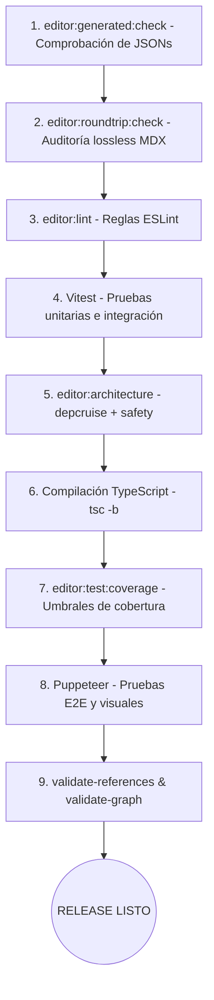

# Scripts de validación y automatismos de CI

Para evitar roturas en la arquitectura, enlaces caídos o alteraciones accidentales en el formato del contenido, el proyecto cuenta con una serie de scripts de verificación en `scripts/`.

---

## Scripts principales de validación (`scripts/core/`)

| Script | Archivo | Qué hace | Qué comprueba |
|---|---|---|---|
| **Indexador de contenido** | [generate-content-index.ts](file:///home/izaro/Proiektuak/Matematika_Drafts/scripts/core/generate-content-index.ts) | Lee los metadatos de los archivos MDX en `content/mdx/`. | Valida la sintaxis con Zod y genera `contentIndex.json`. |
| **Validador de grafo** | [validate-logical-graph.ts](file:///home/izaro/Proiektuak/Matematika_Drafts/scripts/core/validate-logical-graph.ts) | Construye la red de dependencias y calcula la ordenación topológica. | Falla si encuentra **dependencias circulares** o axiomas incompatibles (`alternativeGroup`). |
| **Validador de referencias** | [validate-cross-references.ts](file:///home/izaro/Proiektuak/Matematika_Drafts/scripts/core/validate-cross-references.ts) | Revisa los enlaces salientes `<ConceptLink>`. | Falla si los autores o métodos de demostración no existen en la base de datos. |
| **Cobertura de contenido** | [generate-content-coverage.ts](file:///home/izaro/Proiektuak/Matematika_Drafts/scripts/core/generate-content-coverage.ts) | Comprueba la presencia de diagramas y fuentes en cada artículo. | Genera `contentCoverage.json` para auditar la completitud del corpus. |

---

## Scripts de calidad del editor (`scripts/editor/`)

| Script | Archivo | Qué hace | Qué comprueba |
|---|---|---|---|
| **Auditoría roundtrip MDX** | [audit-mdx-roundtrip.ts](file:///home/izaro/Proiektuak/Matematika_Drafts/scripts/editor/audit-mdx-roundtrip.ts) | Simula ciclos de carga y guardado en todo el corpus MDX. | Falla si cualquier archivo sufre cambios no autorizados fuera de los rangos editados. |
| **Seguridad de código** | [check-editor-safety.ts](file:///home/izaro/Proiektuak/Matematika_Drafts/scripts/editor/check-editor-safety.ts) | Escanea el código del editor en busca de patrones prohibidos. | Falla si encuentra `fetch` en componentes UI, `eval`, `alert` o `@ts-ignore`. |
| **Sincronización de JSONs** | [check-generated-artifacts.ts](file:///home/izaro/Proiektuak/Matematika_Drafts/scripts/editor/check-generated-artifacts.ts) | Compara los JSONs generados contra `git diff`. | Falla si los índices guardados en el repo están desactualizados respecto al código fuente. |
| **Cobertura por riesgo** | [check-editor-coverage.ts](file:///home/izaro/Proiektuak/Matematika_Drafts/scripts/editor/check-editor-coverage.ts) | Analiza los reportes de Vitest en módulos críticos. | Falla si la cobertura en parsers o persistencia cae por debajo del umbral exigido. |

---

## El comprobador de release (`npm run editor:release-check`)

El comando `npm run editor:release-check` pasa todas las barreras de seguridad necesarias antes de un lanzamiento:

---

## Integración Continua (GitHub Actions)

El archivo `.github/workflows/ci.yml` ejecuta `npm run full-check` automáticamente en cada Pull Request para verificar que los cambios no rompan ningún contrato del proyecto.
