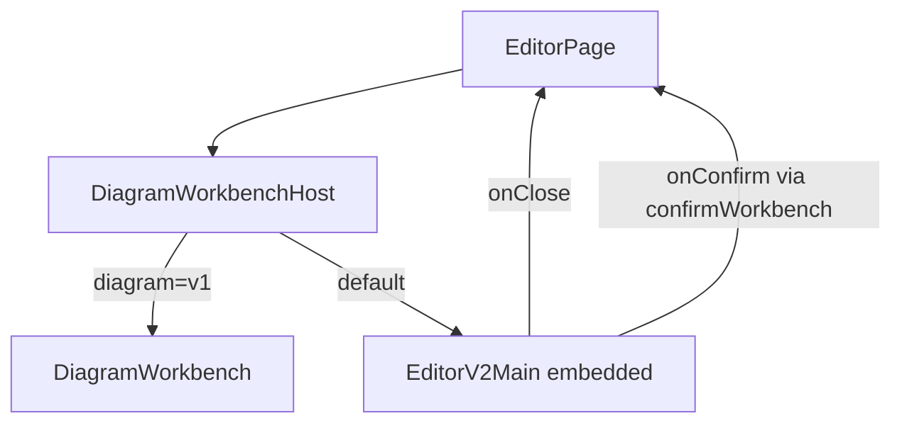

# V2 Official Diagram Workbench Implementation Plan

> **For agentic workers:** REQUIRED SUB-SKILL: Use superpowers:subagent-driven-development (recommended) or superpowers:executing-plans to implement this plan task-by-task. Steps use checkbox (`- [ ]`) syntax for tracking.

**Goal:** When `/editor` opens a diagram, V2 is the default workbench; V1 stays available via `?diagram=v1`; MDX content editor unchanged.

**Architecture:** Add `DiagramWorkbenchHost` with the same props as `DiagramWorkbench`. Default path renders `EditorV2Main` with optional embedded `onClose`/`onConfirm`/`metadataType`. Escape hatch renders existing `DiagramWorkbench`. `EditorPage` swaps only the mount site.

**Tech Stack:** React + TypeScript, Vitest + Testing Library, existing `confirmWorkbench` / `buildTargets` / `DiagramWorkbenchMode`.

**Spec:** [docs/superpowers/specs/2026-07-28-v2-official-diagram-workbench-design.md](docs/superpowers/specs/2026-07-28-v2-official-diagram-workbench-design.md)

## Global Constraints

- Do not delete `DiagramWorkbench` or V1 diagram UI.
- `/editor` stays `EditorPage` (content/MDX).
- Reuse `confirmWorkbench` + `EditorDiagramReference` — no new persistence model.
- Standalone `/editor-v2` and `/editor_v2` keep working.
- Escape hatch: URL query `diagram=v1`.
- Ponytail: fewest files; shortest working diff.

## File map


| File                                                                 | Responsibility                                                          |
| -------------------------------------------------------------------- | ----------------------------------------------------------------------- |
| `src/features/editor/diagrams/ui/diagramWorkbenchVariant.ts`         | `preferLegacyDiagramWorkbench(search): boolean` — true iff `diagram=v1` |
| `src/features/editor/diagrams/ui/DiagramWorkbenchHost.tsx`           | Same props as V1; routes to V1 or embedded V2                           |
| `src/features/editor/v2/ui/EditorV2Main.tsx`                         | Optional `metadataType`, `onClose`, `onConfirm` for embedded use        |
| `src/features/editor/ui/EditorPage.tsx`                              | Mount `DiagramWorkbenchHost` instead of `DiagramWorkbench`              |
| `tests/features/editor/diagrams/DiagramWorkbenchHost.test.tsx`       | Host selects V1 vs V2                                                   |
| `tests/features/editor/v2/EditorV2EmbeddedConfirm.test.tsx`          | Embedded save uses `onConfirm`                                          |
| `docs/superpowers/plans/2026-07-28-v2-official-diagram-workbench.md` | Persist this plan in repo (executor writes on start)                    |





---

## Task 1: Escape-hatch helper + host shell

**Files:**

- Create `src/features/editor/diagrams/ui/diagramWorkbenchVariant.ts`
- Create `src/features/editor/diagrams/ui/DiagramWorkbenchHost.tsx`
- Create `tests/features/editor/diagrams/DiagramWorkbenchHost.test.tsx`
- Also write plan copy to `docs/superpowers/plans/2026-07-28-v2-official-diagram-workbench.md`

- [ ] Write failing tests for `preferLegacyDiagramWorkbench`:
  - `'?diagram=v1'` / `'diagram=v1&x=1'` → `true`
  - `''` / `'?diagram=v2'` / no query → `false`
- [ ] Implement helper:

```ts
export function preferLegacyDiagramWorkbench(search: string): boolean {
  const q = search.startsWith('?') ? search.slice(1) : search;
  return new URLSearchParams(q).get('diagram') === 'v1';
}
```

- [ ] Write failing host tests (mock `DiagramWorkbench` and `EditorV2Main`):
  - `isOpen={false}` → renders nothing
  - open + no `diagram=v1` → V2 mocked marker
  - open + `diagram=v1` (stub `useLocation` / pass search via reading `window.location.search` in host — use `window.location.search` for hatch to avoid new props) → V1 mocked marker
- [ ] Implement host with V1 props type mirrored from `DiagramWorkbench`:

```tsx
// When !isOpen → null
// When preferLegacyDiagramWorkbench(window.location.search) → <DiagramWorkbench ...props />
// Else → <EditorV2Main mode={mode} metadataType={metadataType} onClose={onClose} onConfirm={onConfirm} />
```

  For Task 1, V2 branch can render a stub that accepts those props if `EditorV2Main` not yet extended — or implement Task 2 first in same PR sequence. Prefer: host calls extended props; Task 2 lands before host tests go green for V2 path if types require it. Order within this task: helper green first; host tests may wait until Task 2 if needed. **Ship helper + host structure; V2 prop types completed in Task 2.**

- [ ] Run: `npx vitest run tests/features/editor/diagrams/DiagramWorkbenchHost.test.tsx`
- [ ] Commit: `feat(editor): add diagram workbench host and v1 escape hatch`

---

## Task 2: Embedded close/confirm on `EditorV2Main`

**Files:**

- Modify [src/features/editor/v2/ui/EditorV2Main.tsx](src/features/editor/v2/ui/EditorV2Main.tsx)
- Create `tests/features/editor/v2/EditorV2EmbeddedConfirm.test.tsx`

Extend props:

```ts
interface EditorV2MainProps {
  mode?: DiagramWorkbenchMode;
  metadataType?: string;
  onClose?: () => void;
  onConfirm?: (spec: EditorDiagramReference) => boolean | void | Promise<boolean | void>;
}
```

- [ ] Write failing test: render with `mode` + `onConfirm` spy + `onClose` spy; trigger save (same control V2 header uses — `getByRole`/`name` matching existing V2 tests); expect `onConfirm` called with reference containing `componentName` / `visualModel` / `mode`; standalone render without `onConfirm` still saves via existing path (no throw).
- [ ] Implement:
  - Pass `metadataType ?? 'demostración'` into `useDiagramWorkbenchLoader` (replace hardcoded string).
  - `handleCloseEditor`: if `onClose` provided, call it (keep dirty confirm); else existing `history.back()` / `/`.
  - `handleSaveAndConfirm` (or inline): mirror V1 `[handleSaveAndConfirm](src/features/editor/diagrams/hooks/useWorkbenchActions.ts)` using `confirmWorkbench`, `workbenchIsBlocked`, `buildTargets`, `saveDiagram`; when `onConfirm` absent, `onSave` stays `() => void saveDiagram()`.
  - Wire header + status bar `onSave` to that branch when `onConfirm` is set.
- [ ] Keep sandbox rule: `sandboxMode = !mode` unchanged.
- [ ] Run: `npx vitest run tests/features/editor/v2/EditorV2EmbeddedConfirm.test.tsx tests/features/editor/v2/editorV2.test.tsx tests/features/editor/v2/EditorV2PersistenceMode.test.tsx`
- [ ] Commit: `feat(editor): embed V2 workbench confirm/close for MDX host`

---

## Task 3: Wire host into `EditorPage`

**Files:**

- Modify [src/features/editor/ui/EditorPage.tsx](src/features/editor/ui/EditorPage.tsx)

- [ ] Replace import of `DiagramWorkbench` with `DiagramWorkbenchHost` (keep `DiagramWorkbenchMode` type import from loader/host re-export or existing path).
- [ ] Swap JSX mount (~line 626) to `<DiagramWorkbenchHost …same props… />`.
- [ ] No other EditorPage behavior changes.
- [ ] Finish host tests from Task 1 if deferred; ensure host forwards props.
- [ ] Run: `npx vitest run tests/features/editor/diagrams/DiagramWorkbenchHost.test.tsx tests/features/editor/v2/EditorV2EmbeddedConfirm.test.tsx`
- [ ] Manual smoke (if env available): `/editor` open diagram → V2; `/editor?diagram=v1` → V1; confirm inline diagram still binds.
- [ ] Commit: `feat(editor): default diagram overlay to V2 via workbench host`

---

## Task 4: Verification

- [ ] `npx vitest run tests/features/editor/diagrams/DiagramWorkbenchHost.test.tsx tests/features/editor/v2/EditorV2EmbeddedConfirm.test.tsx tests/features/editor/v2/editorV2.test.tsx tests/features/editor/diagrams/DiagramWorkbench.test.tsx`
- [ ] Confirm `DiagramWorkbench.tsx` still present (no delete).
- [ ] Confirm AppRouter still has `/editor` → EditorPage and `/editor-v2` → EditorV2Page.
- [ ] Commit only if verification fixed anything; otherwise done.

## Out of scope

- Deleting V1 workbench
- Changing content-editor UX beyond the mount swap
- Reworking standalone `/editor-v2` chrome
- Agent skill / docs churn beyond the plan file copy

