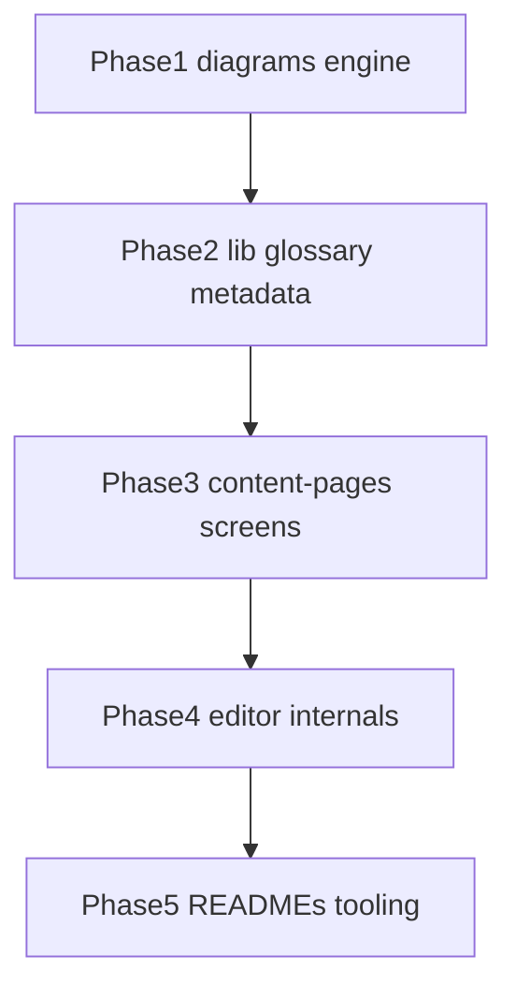

# Internal src findability reorg

> **For agentic workers:** execute phase-by-phase (subagent-driven or sequential). Checkboxes track progress. **Do not commit** unless the user explicitly asks.

**Goal:** Make internal code findable via plain-English folders and READMEs, per [docs/superpowers/specs/2026-08-02-src-internal-reorg-design.md](docs/superpowers/specs/2026-08-02-src-internal-reorg-design.md).

**Architecture:** Keep outer `src/*` names. Split diagram engine into `model` / `geometry` / `jsxgraph` / `render`. Rename editor jargon folders; deepen `editor/diagrams/{model,ui}`. Clean `lib/helpers`, move metadata/glossary. Update all imports + Vite/depcruise/scripts in the same phase as each move.

**Tech stack:** Vite aliases (`@` → `src`, `@content` → `content`), Vitest under `tests/`, depcruise, codebase-memory reindex after structural moves.

## Global constraints

- Spec is source of truth; outer top-level folders stay.
- Keep path segments `src/diagrams/` and `editor/diagrams/`.
- Plain English only; ban folder names: `spec`, `core` (engine), `helpers`, `persistence`, `contracts`, `ux`, editor catch-all `hooks`/`lib`.
- New folder only if ≥3 related files.
- Rewrite logic only to clarify boundaries / split god-files — no new DiagramSpec version, no greenfield editor/renderer.
- **No git commits** during execution unless user asks.
- One domain at a time; never parallelize engine `src/diagrams` with `editor/diagrams`.
- Subagents if used: Cursor **Grok** or **Composer** only.
- After each phase: reindex/stamp code-graph (`npm run code-graph:check` → index if stale → `code-graph:stamp`).



---

## Phase 1 — `src/diagrams/` engine

**Files moved (exact map):**

| From | To |
|---|---|
| `spec/schema.ts`, `schemaV3.ts`, `migrations.ts`, `v3.ts`, `v3Compatibility.ts`, `types.ts` | `model/schema/` |
| `spec/expressions.ts` | `model/expressions/` |
| `spec/semantics.ts`, `infoPanels.ts`, `playback.ts`, `history.ts` | `model/semantics/` |
| `spec/sceneCoordinates.ts`, `scenePointMotion.ts` | `geometry/coordinates/` |
| `spec/curveGeometry.ts` | `geometry/curves/` |
| `spec/areaGeometry.ts`, `areaRegions.ts` | `geometry/areas/` |
| `spec/sceneBounds.ts`, `scenePlan.ts`, `viewport.ts`, `scene.ts`, `sceneTypes.ts` | `geometry/layout/` |
| `core/*` | `jsxgraph/` |
| `runtime/useBoardLifecycle.ts` (+ splits) | `render/lifecycle/` |
| `runtime/createBoardElement.ts`, `boardElementHelpers.ts` | `render/elements/` |
| `runtime/useDiagramSelection.ts`, `diagramHover.ts`, `diagramTopmostHit.ts`, `useDiagramViewport.ts`, related | `render/interaction/` |
| `runtime/DiagramRenderer.tsx`, `DiagramKatexOverlay.tsx`, `diagramRuntimeUtils.ts`, `jsxgraphAdapter.ts`, `stepEmphasisAnimation.ts` | `render/` (root or `interaction/` if purely interactive) |

**Barrels:** rewrite [src/diagrams/index.ts](src/diagrams/index.ts), [src/diagrams/public.ts](src/diagrams/public.ts); add thin `model/index.ts`, `geometry/index.ts`, `jsxgraph/index.ts`, `render/index.ts` re-exporting previous public surface so `@/diagrams` keeps working.

**Import sweep (~219 hits):** replace `@/diagrams/spec` → `@/diagrams/model` or `@/diagrams/geometry/...`; `@/diagrams/core` → `@/diagrams/jsxgraph`; `@/diagrams/runtime` → `@/diagrams/render/...` in `src/`, `tests/`, `content/`, `scripts/`.

**Tooling in same phase:** update `diagramParserContractFiles` paths in [vite.config.ts](vite.config.ts) (`spec/*` → new paths). Update [src/diagrams/README.md](src/diagrams/README.md) (delete `features`/`widgets` wording).

**God-file splits (mechanical, same phase or immediate follow-up PR):**
- `v3Compatibility.ts` → modules under `model/schema/` (e.g. `v3ToV2.ts`, `v2ToV3.ts`, element mappers)
- `useBoardLifecycle.ts` → `render/lifecycle/` pieces (init, update, teardown, element sync)
- `MathFactory.ts` → `jsxgraph/` element creators if natural seams exist
- Prefer extract-without-behavior-change; mark any deferred split with `ponytail:` ceiling comment

**Verify:**
```bash
npx vitest run tests/diagrams
# expect: pass (update import paths in tests as part of move)
```

- [ ] Move files + barrels per map
- [ ] Sweep imports + vite contract file list
- [ ] Split largest god-files or leave `ponytail:` notes
- [ ] README + vitest `tests/diagrams` green
- [ ] code-graph reindex/stamp

---

## Phase 2 — `lib/`, glossary data, metadata

**`src/lib/`:**
- `hooks/useThemeColors.ts` + `helpers/constants.ts` → `theme/`
- keep `stores/`
- `helpers/*Context*`, `MathStore.ts`, `MathStoreContext.tsx` → `page-context/`
- `helpers/mdxParser.ts` → `mdx/`
- `helpers/routeHelper.ts` → `routes.ts` (export `appPath` same API)
- delete empty `helpers/` and `hooks/`

**Glossary:** move `lib/helpers/glossaryDictionary.ts` → [content/glossary/](content/glossary/) (e.g. `dictionary.ts`); update [src/lib/stores/GlossaryStore.ts](src/lib/stores/GlossaryStore.ts) and all importers.

**Metadata:**
- `content-pages/shared/metadata/MetadataStore.ts` → `data/metadata/`
- `content-pages/shared/metadata/ui/*` → `components/metadata/`
- update screens that import `MetadataSidebar` / `useMetadataStore`

**Also fix:** any dangling imports to deleted `@/lib/helpers/*`; refresh [src/lib/README.md](src/lib/README.md), [src/data/README.md](src/data/README.md).

**Verify:**
```bash
npx vitest run tests/widgets tests/features/editor/editorContracts.test.ts 2>/dev/null; npx vitest run tests/widgets
# plus any glossary/metadata-related tests; app must resolve MathProvider from @/lib/page-context
```
Update [src/app/providers/MathStoreContext.tsx](src/app/providers/MathStoreContext.tsx) re-export path.

- [ ] Restructure lib + glossary + metadata moves
- [ ] Import sweep
- [ ] READMEs + tests for touched areas green
- [ ] code-graph stamp

---

## Phase 3 — `content-pages/pages` → `screens`

- Move [src/content-pages/pages/](src/content-pages/pages/) → `src/content-pages/screens/`
- Update router imports in [src/app/routes/](src/app/routes/) (or wherever pages are wired)
- Update [src/content-pages/README.md](src/content-pages/README.md)

**Verify:**
```bash
npx vitest run tests/widgets
# smoke: npm run build or tsc --noEmit if that is the project check for routes
```

- [ ] Move + import update + README
- [ ] Verify routes resolve

---

## Phase 4 — `fixed-pages/editor/`

**Top-level renames:**
| From | To |
|---|---|
| `core/` | `session/` |
| `persistence/` + `state/` | `save/` |
| `ux/` | `review/` |
| `lib/editorContracts.ts`, types-ish | `types/` |
| `lib/editorPaths.ts`, `editorImports.ts`, `editorUtils.ts` | `files/` |
| `lib/metadataFields.ts` | `metadata/` |
| `catalog/` | `templates/` |
| `navigation/` | keep; if still &lt;3 files after cleanup, fold into `session/` |

**`diagrams/` internals:**
- `model/` → subdirs `elements/`, `constraints/`, `scene/`, `tools/` (group the 26 flat files by name/role from spec)
- `state/` → `history/`
- `diagnostics/` → `checks/`
- `persistence/` → `save/`
- dissolve `hooks/`: place each `use*.ts` next to owner (`ui/workbench/`, `history/`, etc.)
- `ui/`: add `workbench/`, `toolbar/`, `constraints/`, `panels/` as needed; keep existing `canvas/`, `inspector/`, `scene/`, `modals/`, `primitives/`

**`ui/` (document chrome):** nest `EditorPage.tsx` under `ui/page/`; keep panels/blocks/… 

**Import sweep:** all `@/fixed-pages/editor/core|persistence|ux|lib|catalog` and relative paths in `tests/features/editor/**`, [scripts/editor/check-editor-coverage.ts](scripts/editor/check-editor-coverage.ts), vite `diagramParserContractFiles` editor paths.

**God-file splits:** `DiagramWorkbench.tsx`, `GroupsAndLayersManager.tsx`, `useEditorCore.ts`, `EditorPage.tsx`, `VisualEditorBlock.tsx` — extract modules into the new subdirs; behavior-preserving.

**Verify:**
```bash
npx vitest run tests/features/editor
# expect: pass after path updates (~prior chat: 643 unit tests in this area)
```

- [ ] Top-level renames + diagrams subdirs + hooks dissolution
- [ ] God-file splits where seams are clear
- [ ] Scripts/vite/tests import sweep
- [ ] README `editor/` + `editor/diagrams/`
- [ ] vitest editor suite green + code-graph stamp

---

## Phase 5 — Docs and enforcement

- Update [src/README.md](src/README.md) “Where is X?” for new internal names
- Grep purge stale refs: `diagrams/spec`, `diagrams/core`, `lib/helpers`, `features/`, `widgets/`, `shared/diagrams` in READMEs, skills under `.agents/skills/`, [docs/](docs/) CODEMAP if present, [.dependency-cruiser.js](.dependency-cruiser.js) path rules
- Align depcruise forbidden paths with new import rules (`model`/`geometry` ↛ `jsxgraph`/`render`; `diagrams/model` ↛ `diagrams/ui`)
- Final: `npm run full-check` (or project’s standard gate) once

- [ ] README + skills + depcruise
- [ ] Repo-wide grep for old paths = 0 (except this plan/spec history)
- [ ] full-check green

---

## Execution notes

- Prefer `git mv` for renames to preserve history; still **do not commit** until asked.
- No long-lived shims under old paths — update callers in the same phase.
- If `npm run dev` still fails on `@/diagrams/spec` mid-migration, finish Phase 1 import sweep before other work.
- Save a copy of this plan also under `docs/superpowers/plans/2026-08-02-src-internal-reorg.md` when implementation starts (write file then; no commit).
