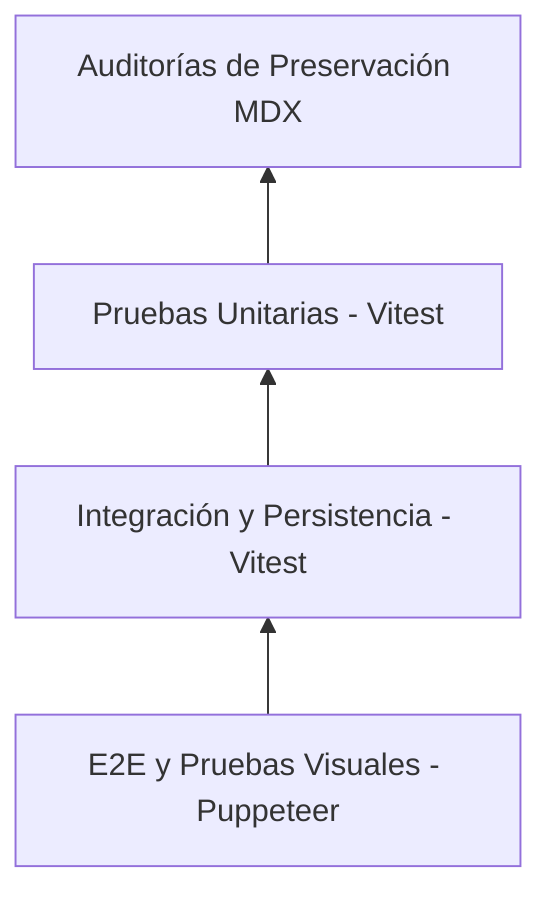

# Estrategia de Pruebas y Cobertura de Código

El proyecto combina varias capas de pruebas (unitarias, integración, E2E con navegador real y auditorías de preservación de archivos) para asegurar que tanto la enciclopedia como el editor funcionen de forma estable.

---

## Niveles de pruebas en el proyecto



---

## 1. Pruebas unitarias e integración (`Vitest`)

Están ubicadas principalmente en `tests/features/editor/` y `tests/components/`.

- **Qué prueban**:
  - Clasificación de bloques AST y parsing de MDX (`parseEditorDocument.test.ts`).
  - Lógica de reducida de diagramas y solvers de geometría.
  - Coordinación de guardado y borradores locales en IndexedDB (`saveCoordinator.test.ts`).
  - Enrutamiento multilenguaje y motor de búsqueda difusa.
- **Comandos**:
  ```bash
  # Ejecutar la suite completa de unit tests
  npm run test

  # Modo rápido (excluye tests de integración largos)
  npm run test:fast

  # Solo tests del editor
  npm run test:editor
  ```

---

## 2. Pruebas End-to-End (E2E) con Puppeteer

Ubicadas en `tests/e2e/editor/editor-safe-ux.e2e.ts`.

- **Cómo funcionan**: Arrancan un servidor local de Vite en el puerto `5177` y lanzan una instancia sin cabeza de Chrome con Puppeteer para probar flujos de usuario reales.
- **Flujos probados (18 casos)**:
  - Alertas al intentar salir sin guardar cambios (*dirty state*).
  - Recuperación de borradores tras un cierre accidental del navegador.
  - Conflictos cuando un archivo cambia en disco mientras está abierto en el editor.
  - Atajos de teclado en Monaco.
  - Comportamiento ante caídas temporales de red durante el guardado.
- **Comando**:
  ```bash
  npm run editor:test:e2e
  ```

---

## 3. Pruebas visuales y de diagramas

Ubicadas en `tests/e2e/editor/real-diagrams.e2e.ts`.

- **Qué comprueban**:
  - Que los elementos geométricos del lienzo JSXGraph se carguen según la especificación JSON.
  - Que las etiquetas KaTeX superpuestas (`data-diagram-label-for`) mantengan la referencia correcta con los objetos del canvas (`data-diagram-object-id`).
  - Que al arrastrar puntos en el canvas las fórmulas sigan la trayectoria adecuada.
- **Comando**:
  ```bash
  npm run editor:test:visual
  ```

---

## 4. Auditorías de preservación del corpus (Roundtrip MDX)

Script: `scripts/editor/audit-mdx-roundtrip.ts`.

- **Qué hace**: Abre cada archivo `.mdx` de `content/mdx/`, simula tres ciclos seguidos de edición en memoria y guardado, y compara el hash SHA-256 del resultado con el archivo original.
- **Objetivo**: Garantizar que el motor del editor no altere el formato, comentarios o sangrías de los artículos que no hayan sido modificados visualmente.
- **Comando**:
  ```bash
  npm run editor:roundtrip:check
  ```

---

## Umbrales de cobertura obligatorios (`check-editor-coverage.ts`)

El script de cobertura exige los siguientes mínimos por módulo crítico:

| Módulo / Archivo | Cobertura Mínima Exigida |
|---|---|
| Motor MDX (`src/fixed-pages/editor/document/`) | $\ge 90\%$ líneas |
| Aplicador de parches (`applySourceEdits.ts`) | $\ge 95\%$ líneas |
| Guardado y persistencia (`saveCoordinator.ts`) | $\ge 88\%$ líneas |
| Reductores de diagramas (`src/fixed-pages/editor/diagrams/`) | $\ge 85\%$ líneas |
