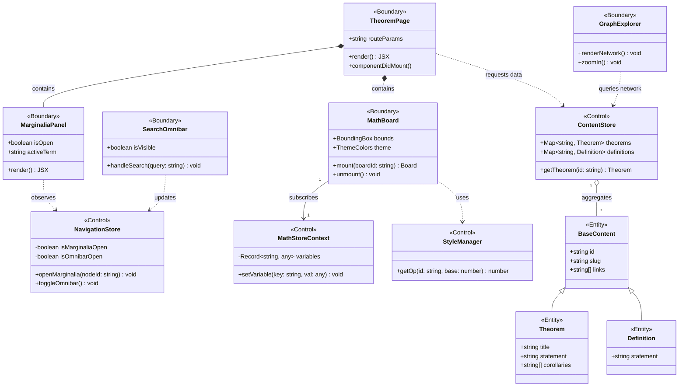

# Diagrama de Clases Avanzado (Modelo de Datos, Stores y Boundary)

Este modelo UML muestra la arquitectura de clases orientada al patrón BCED (Boundary, Control, Entity, Database).

```mermaid
classDiagram
    %% Boundary Package (UI Components)
    class TheoremPage {
        <<Boundary>>
        +string routeParams
        +render() JSX
        +componentDidMount()
    }
    
    class MarginaliaPanel {
        <<Boundary>>
        +boolean isOpen
        +string activeTerm
        +render() JSX
    }
    
    class SearchOmnibar {
        <<Boundary>>
        +boolean isVisible
        +handleSearch(query: string) void
    }
    
    class GraphExplorer {
        <<Boundary>>
        +renderNetwork() void
        +zoomIn() void
    }

    class MathBoard {
        <<Boundary>>
        +BoundingBox bounds
        +ThemeColors theme
        +mount(boardId: string) Board
        +unmount() void
    }

    %% Control Package (Stores and Contexts)
    class ContentStore {
        <<Control>>
        +Map~string, Theorem~ theorems
        +Map~string, Definition~ definitions
        +getTheorem(id: string) Theorem
    }

    class NavigationStore {
        <<Control>>
        -boolean isMarginaliaOpen
        -boolean isOmnibarOpen
        +openMarginalia(nodeId: string) void
        +toggleOmnibar() void
    }

    class MathStoreContext {
        <<Control>>
        -Record~string, any~ variables
        +setVariable(key: string, val: any) void
    }

    class StyleManager {
        <<Control>>
        +getOp(id: string, base: number) number
    }

    %% Entity Package (Data Models)
    class BaseContent {
        <<Entity>>
        +string id
        +string slug
        +string[] links
    }

    class Theorem {
        <<Entity>>
        +string title
        +string statement
        +string[] corollaries
    }

    class Definition {
        <<Entity>>
        +string statement
    }

    BaseContent <|-- Theorem
    BaseContent <|-- Definition

    %% Relations
    TheoremPage ..> ContentStore : requests data
    TheoremPage *-- MathBoard : contains
    TheoremPage *-- MarginaliaPanel : contains
    
    MarginaliaPanel ..> NavigationStore : observes
    SearchOmnibar ..> NavigationStore : updates
    GraphExplorer ..> ContentStore : queries network
    
    MathBoard "1" --> "1" MathStoreContext : subscribes
    MathBoard ..> StyleManager : uses
    ContentStore "1" o-- "*" BaseContent : aggregates
```
