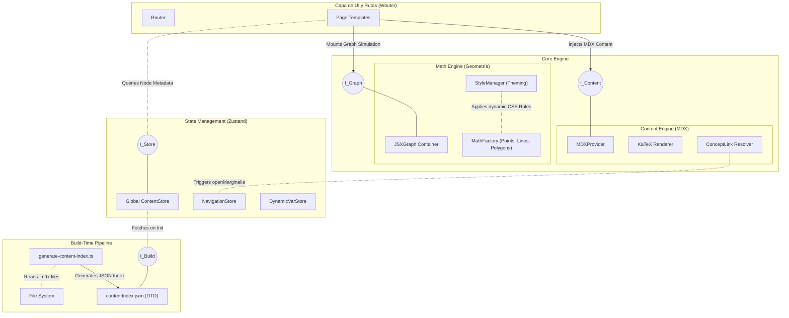

# Diagrama de Componentes Avanzado (Puertos y DTOs)

Este diagrama UML detalla las interfaces de comunicación, los puertos y los flujos de *Data Transfer Objects* (DTOs) que conectan las distintas capas lógicas del sistema Matematika.

## Flujos de Datos (DTOs)
1. **DTO `contentIndex.json`:**
   - Transporta un grafo masivo en formato JSON donde las claves son identificadores únicos (slugs) y los valores incluyen metadata vital (título, autor, taxonomía `branch`, y arrays de lemas/corolarios).
2. **Puertos Abiertos:**
   - El Motor Geométrico (`Math Engine`) no consume directamente el `Global ContentStore`. Los componentes se enlazan mediante variables pasadas vía props y estado local (`MathProvider`), siguiendo el principio de Responsabilidad Única (SRP).
3. **Pipeline Estático:**
   - Todo el proceso intensivo de parsear Markdown se abstrae al sistema de compilación de Vite; el cliente web solo procesa componentes React hidratados, aumentando dramáticamente el rendimiento del `Time To Interactive`.
