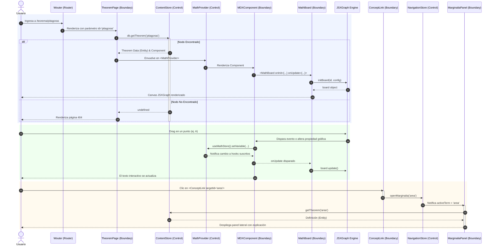

# Diagrama de Secuencia Avanzado (Orientado a BCED)

Este diagrama mapea flujos lógicos con condicionales (`alt/else`) que explican el comportamiento dinámico y las validaciones de UI, utilizando la terminología Boundary-Control-Entity.

