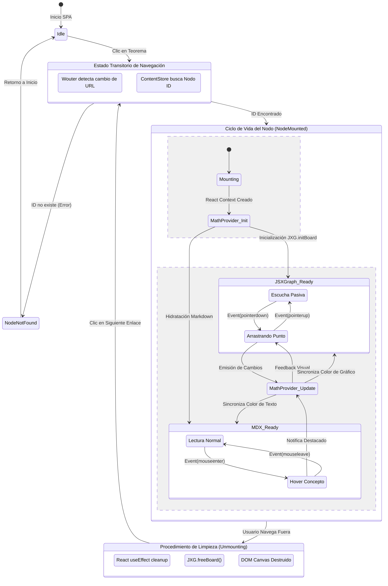

# Diagrama de Estado Avanzado (Gestión de Memoria y Ciclo WebGL)

El siguiente diagrama utiliza notación de sub-estados para mapear cómo Matematika gestiona el lienzo, los listeners de redibujado (reactividad cruzada) y el `Garbage Collector` del navegador.

## Transiciones Críticas
1. **Región Concurrente (NodeMounted):** Las zonas `JSXGraph_Ready` y `MDX_Ready` operan en paralelo y envían/reciben datos hacia el mismo bus interno (`MathProvider_Update`). Esto evita bucles infinitos al depender de validadores de igualdad estricta.
2. **Procedimiento `Unmounting`:**
   - La eliminación de los Canvas WebGL o SVG de `JSXGraph` no es automática en React. 
   - `JXG.freeBoard()` desconecta físicamente los `EventListeners` adosados al objeto `window` por la biblioteca.
   - Sin esta etapa, cada nuevo nodo montado consumiría ~20MB adicionales de memoria RAM, provocando una caída de los FPS e inestabilidad (Crash) del navegador tras ~50 navegaciones.
