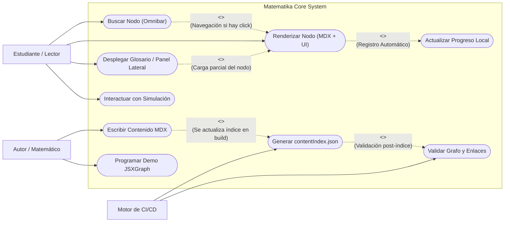

# Casos de Uso e Historias de Usuario

## 1. Diagrama de Casos de Uso (UML)

El siguiente diagrama detalla las fronteras del sistema e incluye relaciones avanzadas (`<<include>>` y `<<extend>>`).

---

## 2. Especificación Formal de Casos de Uso

A continuación se detalla el flujo de todos los procesos expuestos en el diagrama.

### UC-1: Buscar Nodo (Omnibar)
- **Actor Principal:** Estudiante / Lector.
- **Precondición:** El usuario se encuentra navegando en cualquier página de la aplicación web.
- **Flujo Principal:**
  1. El usuario presiona el atajo global de teclado (`Cmd+K` / `Ctrl+K`) o hace clic en el icono de búsqueda.
  2. El sistema abre el componente modal Omnibar, modificando el estado `isSearchOpen` en el `NavigationStore`.
  3. El usuario teclea un término matemático.
  4. El sistema emplea el motor de búsqueda difusa (`Fuse.js`) sobre los registros combinados del `ContentStore` y el diccionario estático del Glosario.
  5. Se muestra una lista de resultados filtrada y categorizada en milisegundos.
  6. El usuario selecciona un resultado usando las flechas direccionales y `Enter`, o haciendo clic.
  7. El sistema efectúa la navegación hacia la URL del concepto utilizando `wouter`.
- **Postcondición:** El usuario ha saltado rápidamente a la unidad de conocimiento deseada sin recurrir al árbol jerárquico.

### UC-2: Renderizar Nodo (MDX + UI)
- **Actor Principal:** Estudiante / Lector.
- **Precondición:** El usuario accede a una URL de un recurso (ej. `/teorema/tales`).
- **Flujo Principal:**
  1. El enrutador (`wouter`) intercepta la petición y carga el componente orquestador correspondiente (ej. `TheoremPage`).
  2. La página envía el ID o *slug* al Singleton `ContentStore` mediante peticiones como `db.getTheorem('tales')`.
  3. El Store devuelve la instancia rica (`BaseContent`) conteniendo metadatos y el componente lazy-loaded del MDX.
  4. La aplicación envuelve la vista en un nuevo `<MathProvider>` para aislar el contexto matemático de otras pantallas.
  5. React evalúa y monta el componente MDX, renderizando la sintaxis estándar, las fórmulas procesadas por KaTeX y cualquier componente React incrustado.
- **Flujos Alternativos:**
  - *3a.* Si la búsqueda en el Store devuelve `undefined`, el sistema aborta y renderiza una pantalla genérica de 404 ("Página no encontrada").
- **Postcondición:** El lector dispone de la lección formateada con todas sus gráficas operativas.

### UC-3: Desplegar Glosario / Panel Lateral (Navegación Contextual)
- **Actor Principal:** Estudiante.
- **Precondición:** El usuario está leyendo un nodo (ej. `teorema/pitagoras`) y se topa con un `ConceptLink` (ej. apuntando a `area`).
- **Flujo Principal:**
  1. El usuario hace clic en el enlace del concepto.
  2. El sistema previene la recarga de página web normal para mantener el progreso actual.
  3. El sistema invoca al estado de Zustand `useGlossaryStore().openTerm('area')`.
  4. La UI reacciona y despliega el panel lateral interactivo (Sidebar) sobre el contenido principal.
  5. El componente Sidebar solicita la información pertinente al `ContentStore` o al diccionario de definiciones rápidas.
  6. Se renderiza la explicación rápida, la ecuación en LaTeX y/o una miniatura en el panel lateral.
- **Flujos Alternativos:**
  - *1a.* El nodo destino no está en el índice ni en el diccionario local: El `ConceptLink` lo detecta preventivamente. En vez de reaccionar abriendo el glosario, el enlace luce como "roto" y al hacer clic redirige a la plantilla `/construccion/area`.
- **Postcondición:** El usuario ha resuelto su duda sobre el término sin perder el hilo de lectura original.

### UC-4: Interactuar con Simulación (Data-Binding)
- **Actor Principal:** Estudiante.
- **Precondición:** Existe un `MathProvider` local montado que incluye un `<MathBoard>` y un motor JSXGraph visible en pantalla.
- **Flujo Principal:**
  1. El usuario arrastra un objeto geométrico en el lienzo (ej. mueve el vértice de un triángulo).
  2. El motor JSXGraph re-calcula las posiciones geométricas y dispara sus eventos internos `board.on('update')`.
  3. La lógica procedimental del componente (ej. `StyleManager` o código personalizado de la Demo) evalúa si la nueva posición geométrica cumple ciertos axiomas.
  4. De ser necesario, se propaga un cambio mutando el Contexto local con `useMathStore().setVariable('highlight', ...)`.
  5. Inmediatamente, los componentes en el documento MDX que leen ese valor aplican una clase CSS dinámica, iluminando o revelando párrafos condicionalmente.
- **Postcondición:** Gráficas y texto reaccionan orgánicamente a la manipulación del usuario en tiempo real.

### UC-5: Actualizar Progreso Local
- **Actor Principal:** Estudiante / Sistema.
- **Precondición:** El estudiante ha terminado de leer o asimilar una teoría (o ha resuelto el 100% de un interactivo).
- **Flujo Principal:**
  1. El sistema dispara el evento de éxito, invocando al store de persistencia Zustand: `UserProgressStore`.
  2. Se llama a la mutación adecuada, tal como `markAsRead('id')` o `markExerciseComplete('id')`.
  3. El middleware `persist` de Zustand serializa el array actualizado y lo guarda en el `localStorage` del navegador del usuario de forma silenciosa.
  4. A nivel de UI, todos los `<ConceptLink>` asociados al ID en cuestión actualizan su estado y renderizan una marca de verificación (`✓`).
- **Postcondición:** El aprendizaje queda gamificado y conservado de cara a posteriores sesiones en el mismo equipo.

### UC-6: Escribir Contenido MDX
- **Actor Principal:** Autor / Matemático.
- **Precondición:** El autor tiene clonado el repositorio de la aplicación en su entorno local y configurado un editor.
- **Flujo Principal:**
  1. El autor crea un archivo físico `.mdx` en el subdirectorio que tipifica el contenido (ej. `src/content/theorems/`).
  2. Redacta el Frontmatter YAML adhiriéndose estrictamente al esquema Zod predefinido (`id`, `title`, `authors`, `tags`, dependencias).
  3. Escribe el cuerpo matemático con soporte nativo Markdown y ecuaciones matemáticas.
  4. Intercala etiquetas de React personalizadas cuando es preciso invocar elementos didácticos superiores (ej. `<Proof>`, `<ConceptLink>`).
- **Postcondición:** El sistema de ficheros alberga una nueva lección, teóricamente válida, lista para ser compilada.

### UC-7: Programar Demo JSXGraph
- **Actor Principal:** Autor / Matemático.
- **Precondición:** Un teorema o lección requiere la demostración interactiva de una proposición geométrica o algebraica.
- **Flujo Principal:**
  1. El autor crea un nuevo componente `.tsx` en el directorio de demostraciones (`src/components/diagrams/Demos/`).
  2. Instancia la envoltura oficial abstracta `<MathBoard>`, pasando coordenadas de vista (`boundingbox`).
  3. Dentro de la propiedad inyectable de inicialización (`onInit`), redacta la lógica fundacional en código de JSXGraph (`board.create(...)`), creando puntos, rectas e intersecciones parametrizadas.
  4. Incorpora funciones evaluadoras en el `onUpdate` para enviar señales de vuelta al texto a través de las stores pertinentes.
  5. Importa este componente personalizado en el respectivo archivo MDX.
- **Postcondición:** El ecosistema suma un modelo digital gráfico capaz de acompañar una argumentación matemática pura.

### UC-8: Generar contentIndex.json
- **Actor Principal:** Motor de CI/CD (o terminal local en Vite).
- **Precondición:** Se dispara el ciclo de vida `prebuild` o `generate-index` de NPM antes de empaquetar o lanzar el servidor de desarrollo.
- **Flujo Principal:**
  1. Un script de Node (ej. `tsx scripts/generate-content-index.ts`) comienza a recorrer transversalmente el sistema de archivos de `src/content`.
  2. Por cada fichero MDX, la librería `gray-matter` aísla los metadatos YAML de la cabecera.
  3. Se sanitizan los IDs de los ficheros para crear las URIs absolutas.
  4. Zod verifica si la metadata proporcionada es válida de acuerdo a los esquemas de la arquitectura.
  5. Una vez compilado todo el mapa del conocimiento, se guarda en disco escribiendo el gran fichero JSON resultante en `src/store/contentIndex.json`.
- **Postcondición:** Todo el front-end puede depender de consultas instantáneas asíncronas sobre este mapa central sin necesidad de hacer I/O de disco en caliente.

### UC-9: Validar Grafo y Enlaces
- **Actor Principal:** Motor de CI/CD (o terminal local).
- **Precondición:** El índice del conocimiento de UC-8 ha sido generado.
- **Flujo Principal:**
  1. Los scripts `validate-graph.ts` y `validate-cross-references.ts` son invocados de forma automatizada por el pipeline pre-build.
  2. El sistema analiza el grafo lógico buscando que ninguna dependencia (`requires`, `lemmas`) exija a un nodo inexistente.
  3. El sistema rastrea mediante Regex los textos MDX reales, desenterrando cualquier invocación al componente `<ConceptLink targetId="..."/>`.
  4. Comprueba sistemáticamente que el destino del link exista en el índice unificado o en el glosario léxico.
- **Flujos Alternativos:**
  - *4a.* Algún enlace o dependencia lógica no se puede trazar al índice: El script estalla a propósito emitiendo un código de salida fallido (`process.exit(1)`), advirtiendo en consola qué archivo tiene la inconsistencia y de ese modo se rompe intencionadamente la "build", evitando la subida a Producción.
- **Postcondición:** Se garantiza un 100% de integridad estructural; Matematika jamás desplegará enlaces estáticos muertos a Github Pages.

---

## 3. User Stories Refinadas (Criterios de Aceptación)

### Épica: Exploración Fluida (UX)
- **US-1.1:** Como *Estudiante*, quiero usar el Omnibar desde cualquier pantalla para que se abra un buscador universal instantáneo.
  - *Criterios de Aceptación:* Debe filtrar resultados instantáneamente. Debe permitir selección con flechas de teclado.

### Épica: Calidad y Mantenibilidad del Código
- **US-2.1:** Como *Autor*, necesito que al compilar el código (`npm run prebuild`), los scripts automatizados `generate-index` y `validate-references` me adviertan con un listado exacto de los archivos `.mdx` que tienen `<ConceptLink>` rotos.
  - *Criterios de Aceptación:* El script falla devolviendo un código de salida distinto a cero en terminal y lista explícitamente qué enlace está roto en la jerarquía del Grafo antes de hacer el build de Vite.
